# 웹 서버 성능 최적화 과정 : Nginx부터 슬로우 쿼리까지

## 서론

본 문서는 Spring Boot 기반 웹 애플리케이션의 성능 한계를 식별하고, 체계적인 부하 테스트와 분석을 통해 병목 지점을 해결해나간 전체 과정을 기록한 기술 리포트입니다.

프로젝트 초기, '기본 설정으로도 충분하다'는 막연한 가정에서 벗어나 선제적으로 성능을 검증하고 개선하는 것을 목표로 삼았습니다. 

전체 최적화 과정은 크게 두 단계로 나누어 진행되었습니다. **1단계**에서는 Nginx, Tomcat 스레드풀, HikariCP 커넥션풀 등 인프라 레벨의 설정을 튜닝하여 기본적인 처리 용량을 확보했으며, **2단계**에서는 보다 현실적인 테스트 환경을 구축하여 애플리케이션 내부의 슬로우 쿼리와 데이터 편향성 문제를 해결하는 심층 분석을 수행했습니다.

이 문서는 데이터 기반의 가설 설정, 테스트를 통한 검증, 점진적 개선이라는 반복적인 사이클을 통해 어떻게 시스템의 안정성과 효율성을 높여나갔는지 상세히 기술합니다.

---

### 핵심 성과
본 프로젝트는 '기본 설정' 상태의 웹 서버가 동시 사용자 600명 수준에서 Connection reset 오류와 함께 장애가 발생하는 문제에서 출발했습니다. 
  2단계에 걸친 체계적인 부하 테스트 재설계와 성능 최적화를 통해, 최종적으로 MAU 3000명, DAU 900명의 환경에서 평균 40 RPS를 안정적으로 처리하고 주요 API의 P95 응답 시간을 5초대에서 1초 미만으로 단축하는 성과를 거두었습니다. 
  이 과정에서 Nginx, Tomcat, HikariCP 등 인프라 레벨 튜닝부터 시작하여, DTO 프로젝션, 인덱싱 전략, 그리고 테스트 데이터 정규화에 이르는 심층적인 애플리케이션 개선을 수행하며 End-to-End 성능 최적화 역량을 확보했습니다.

### 글의 목표
- 성능 튜닝 전후의 차이를 K6 부하 테스트 지표를 통해 명확하게 보여드립니다.
- 서버 사양과 서비스 특성을 종합적으로 고려하여 스레드풀과 커넥션풀을 튜닝하는 방법을 소개합니다.
- 부하테스트에서 신중한 초기 가설 설정과 검증의 중요성을 사례를 통해 보여드립니다.

### 대상 독자
- 스레드풀과 커넥션풀의 이론은 알고 있지만, 실제 운영 환경에 적용해 본 경험은 없는 개발자분들
- 현재 서버가 잘 동작한다는 이유로 추가적인 성능 튜닝을 고려하지 않았던 개발자분들
- 부하테스트를 해보았으나 실제 부하 상황이 왔을 때 서버가 안전할 것이라 보장하기 어려운 개발자분들

---

## 1단계: 초기 병목 식별 및 인프라 튜닝

### 테스트 환경

- **서버 사양:**
  - 애플리케이션 (WAS): AWS EC2 `t4g.small` (vCPU 2, 2GiB RAM)
  - 리버스 프록시 (Nginx): AWS EC2 `t4g.nano` (vCPU 2, 0.5GiB RAM)
- **데이터베이스:**
  - 핵심 테이블 데이터 약 `500건`
- **애플리케이션 설정:**
  - Tomcat `max-threads`: 200 (default)
  - HikariCP `maximum-pool-size`: 10 (default)
  - Nginx `worker_connections`: 512 (default)
- **부하 테스트 시나리오 (K6):**
  - **가상 사용자(VU):** 10분간 목표 300~1000VUs까지 점진적 증가 후 10분간 유지
  - **테스트 스크립트:** 가장 많은 API를 호출하는 메인 페이지 진입 테스트

### 1.1. 초기 성능 측정 및 문제 발생

성능 튜닝의 첫 단계는 시스템의 **현재 처리 능력 한계를 파악하는 것**이었습니다. 부하 테스트 도구로 K6를 사용하여, 서비스에서 가장 호출 빈도가 높은 메인 페이지 조회 API에 대한 부하를 점진적으로 증가시켰습니다.

- **초기 테스트 결과:** 가상 사용자(VU)가 약 600명에 도달하는 시점부터 **`Connection reset by peer`** 오류가 발생하며 요청이 실패하기 시작했습니다.
- **서버 상태 분석:** 해당 시점에 Tomcat의 활성 스레드(200개)와 HikariCP의 활성 커넥션(약 200개)이 모두 최대치에 도달하며 시스템이 포화 상태에 이르렀음을 확인했습니다. CPU 사용률이 최대 99%까지 올랐습니다. 이는 명백한 병목 현상이었습니다.

<figure>
  
  <figcaption>그림 1-1: 초기 성능 테스트 RPS. 가상 사용자가 증가함에 따라 RPS가 더 이상 오르지 못하고 정체되어 있습니다.</figcaption>
</figure>
<figure>
  
  <figcaption>그림 1-2: 초기 테스트 Tomcat 활성 스레드. 최대치인 200개에 도달하여 시스템이 완전히 포화되었음을 보여줍니다.</figcaption>
</figure>
<figure>
  
  <figcaption>그림 1-3: 초기 테스트 CPU 사용률. 과도한 스레드로 인한 컨텍스트 스위칭으로 CPU 사용률이 99%에 육박합니다.</figcaption>
</figure>

 

### 1.2. 1차 튜닝: Tomcat 스레드풀 및 HikariCP 커넥션풀 조정

초기 분석을 통해 애플리케이션 서버와 DB 커넥션 풀이 병목 지점일 것이라는 가설을 세우고 튜닝을 진행했습니다.

- **Tomcat 스레드풀:** 저희가 사용한 `t4g.small` 인스턴스(2 vCPU)와 I/O보다 CPU 사용률이 높은 애플리케이션 특성을 고려하여, `max-threads` 값을 기본값 200에서 `3`으로 대폭 줄였습니다. 이는 과도한 스레드로 인한 컨텍스트 스위칭 비용을 줄여 CPU 효율성을 높이기 위함이었습니다.
  - 스레드풀 크기는 다음 공식을 참고하여 도출한 값입니다.
    > MaxThreads ≈ CPU 코어 수 × (1 + (I/O 대기 시간 / CPU 사용 시간))
- **HikariCP 커넥션풀:** 튜닝한 스레드풀의 크기에 맞춰 커넥션풀의 크기를 `2`로 조정하여 불필요한 유휴 커넥션을 줄이고 DB 부하를 관리했습니다.
   커넥션풀 크기는 스레드풀 크기와 유사하게 설정하되 DB 처리 지연 시에도 Pending Connection이 생기지 않도록 도출한 값입니다.

- **결과** : 
  - **성공** : 컨텍스트 스위칭 비용이 극적으로 줄면서 스레드풀 병목과 커넥션풀 병목이 해소되고, 최대 RPS `191rps`, 응답 시간이 최대 `30ms`로 안정회되었습니다.
<figure>
  
  <figcaption>그림 2-1: Tomcat/HikariCP 튜닝 후 RPS. 최대 191 RPS까지 처리량이 크게 향상되었습니다.</figcaption>
</figure>
<figure>
  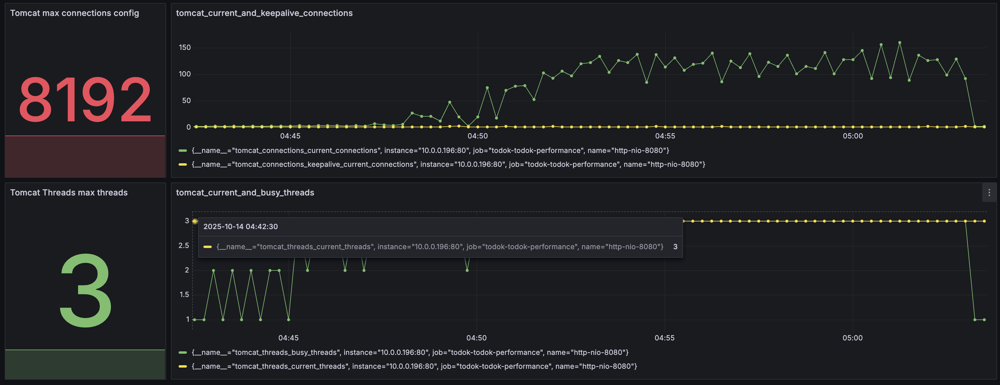
  <figcaption>그림 2-2: 튜닝 후 Tomcat 활성 스레드. 스레드 수가 3개로 제어되어 안정적으로 유지됩니다.</figcaption>
</figure>
<figure>
  
  <figcaption>그림 2-3: 튜닝 후 응답 시간. 평균 응답 시간이 30ms 수준으로 크게 단축 및 안정화되었습니다.</figcaption>
</figure>
<figure>
  
  <figcaption>그림 2-4: 튜닝 후 CPU 사용률. 컨텍스트 스위칭 비용이 줄어 CPU 사용률이 안정적으로 관리됩니다.</figcaption>
</figure>
  - **한계** : 그러나 이 조치만으로는 500~600VUs에서는 여전히 `Connection reset by peer` 오류를 해결할 수 없었습니다.

 

### 1.3. 근본 부하 지점 발견 및 해결: Nginx 튜닝

문제의 근본 원인은 요청의 가장 앞단인 Nginx에 있었습니다. Nginx 로그 분석 결과, **`512 worker_connections are not enough`** 오류를 발견했습니다.

- **원인:** Nginx의 `worker_connections` 설정이 기본값인 `512`로 되어 있어, 리버스 프록시 환경에서 처리할 수 있는 동시 요청(약 256개)의 한계가 너무 낮았습니다. 이 한계를 초과하는 요청이 유입되자 Nginx가 연결을 강제로 종료하면서 오류가 발생한 것이었습니다.
- **해결:** `worker_connections`를 `1024`로 상향 조정하고, TCP 연결 재사용을 위한 `keepalive` 설정을 `32`로 추가했습니다.

이 튜닝을 통해 Nginx 병목이 해소되었고, 서버는 **최대 600명의 동시 사용자 요청을 안정적으로 처리**할 수 있게 되었습니다. 안정적인 RPS는 최대 500명대인 것으로 확인되었습니다.

<figure>
  
  <figcaption>그림 3-1: Nginx 튜닝 후 RPS. 500명의 가상 사용자까지 모든 요청이 안정적으로 처리됩니다.</figcaption>
</figure>
<figure>
  
  <figcaption>그림 3-2: Nginx 튜닝 후 Tomcat 스레드. Nginx 병목이 해결된 후에도 스레드 풀은 안정적으로 유지됩니다.</figcaption>
</figure>

 

### 1.4. 1단계 결론 및 한계, 새로운 의문

1단계 튜닝은 성공적이었지만, 저희는 테스트의 신뢰성에 대해 의문을 갖게 되었습니다. 

서버 사양이 t4g.small의 저사양임에도 불구하고, 600명의 가상 사용자에 대해 177 RPS가 나온 것은 매우 높은 수치였습니다. 저희는 이 결과를 그대로 신뢰하기 어렵다고 판단했고, 테스트의 일부 환경 설정이 미흡했다는 것을 확인했습니다.

1.  **비현실적인 데이터:** 500건 미만의 적은 데이터로 테스트하여 DB 부하가 실제 운영 상황을 전혀 반영하지 못했습니다.
2.  **단순한 시나리오:** 고정된 리소스 ID를 반복 요청하여 캐시 효율이 비정상적으로 높게 측정되었습니다.

이러한 한계는 숨겨진 병목을 가릴 수 있다고 판단했고, **현재까지 진행한 테스트의 결과는 신뢰도가 떨어진다**는 것을 확인했습니다.

보다 현실적인 환경에서 심층 분석을 진행하기로 결정했습니다.

 

---

## 2단계: 심층 분석 및 애플리케이션 최적화

### 2.1. 성능 목표 재정의 및 테스트 환경 고도화

2단계에서는 보다 정교한 목표 설정과 현실적인 테스트 환경 구축에 집중했습니다.

- **목표 재설정:** 예상 사용자 트래픽(MAU 3,000명)을 기반으로 데이터 중심의 분석을 통해 **피크 타임 목표 RPS를 약 21**로 재정의했습니다. 해당 RPS에서 서비스를 안정적으로 서빙하는 것에 목표를 두고, 서버의 한계를 측정하는 것을 목표로 두지 않았습니다.
  - **서비스 특성 분석:**
    - **유형:** 토론 기반 커뮤니티 서비스
    - **사용자 행동 패턴:** 짧고 잦은 재방문, 조회 중심의 트래픽 발생 예상

  - **목표 RPS 도출 과정:**
  
    | 항목 | 계산 근거 | 결과 |
    | --- | --- | --- |
    | **MAU** (월 평균 활성 사용자) | 서비스 목표치 | `3,000명` |
    | **DAU** (일 평균 활성 사용자) | MAU의 30% | `900명` |
    | **1인당 일일 평균 접속 횟수** | 사용자 행동 패턴 가정 | `5회` |
    | **1회 접속 시 평균 요청 수** | 사용자 행동 패턴 가정 | `30개` |
    | **하루 총 예상 요청 수** | 900명 × 5회 × 30개 | `135,000건` |
    | **평균 RPS** (18시간 기준) | 135,000건 / 64,800초 | `약 2.08 RPS` |
    | **목표 피크 타임 RPS** | 평균 RPS × 10배 (집중률) | **`약 21 RPS`** |
  
- **환경 고도화:**
    1.  **대용량 데이터:** DB에 약 10만 건의 데이터를 삽입했습니다.
    2.  **복합 시나리오:** 실제 사용자 행동을 모방하여 다양한 API를 가중치에 따라 호출하는 복잡한 K6 스크립트를 작성했습니다.

### 테스트 환경

새로운 테스트 환경은 아래와 같습니다.

- **서버 사양:**
  - 애플리케이션 (WAS): AWS EC2 `t4g.small` (vCPU 2, 2GiB RAM)
  - 리버스 프록시 (Nginx): AWS EC2 `t4g.nano` (vCPU 2, 0.5GiB RAM)
- **데이터베이스:**
  - 핵심 테이블 데이터 약 `100,000건`
- **애플리케이션 설정:**
  - Tomcat `max-threads`: 5
  - HikariCP `maximum-pool-size`: 7
  - Nginx `worker_connections`: 1024
- **부하 테스트 시나리오 (K6):**
  - **가상 사용자(VU):** 20분간 VU 200명까지 점진적 증가 후 유지
  - **테스트 스크립트:** 실제 사용자 행동을 모방하여 다양한 API(주로 GET)를 가중치에 따라 비동기적으로 호출하는 시나리오 적용

 

### 2.2. 숨겨진 병목 발견: 슬로우 쿼리

고도화된 환경에서 테스트를 재개하자, 이전에는 보이지 않았던 심각한 문제가 발생했습니다.

<figure>
  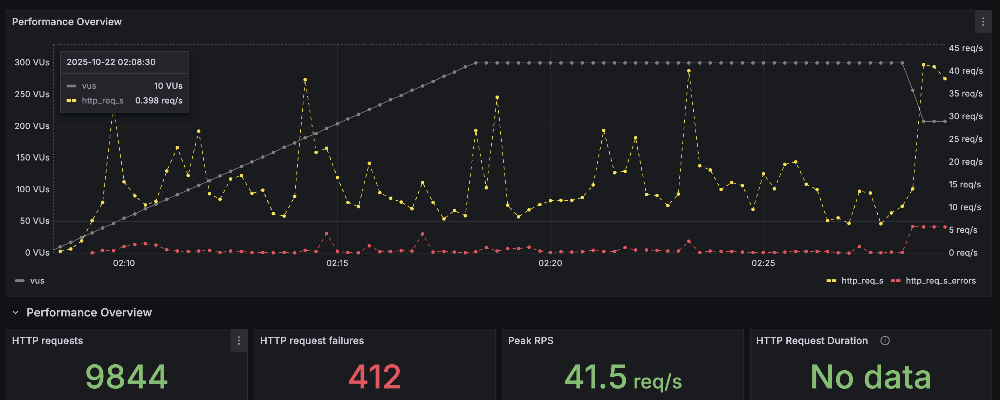
  <figcaption>그림 4-1: 2단계(대용량 데이터) 테스트 RPS. 테스트 시작 직후 요청 처리가 실패하며 RPS가 0으로 떨어집니다.</figcaption>
</figure>
<figure>
  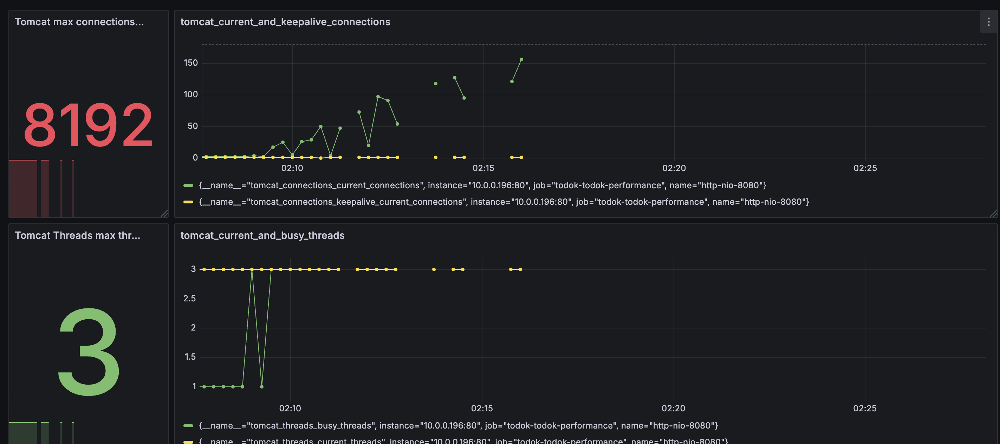
  <figcaption>그림 4-2: 2단계 테스트 Tomcat 활성 스레드. 요청이 처리되지 못해 스레드가 유휴 상태로 남아있습니다.</figcaption>
</figure>
<figure>
  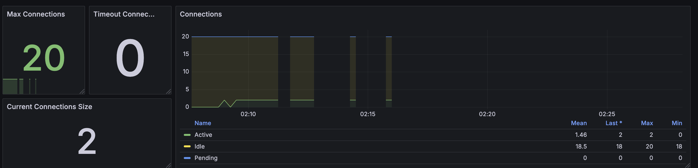
  <figcaption>그림 4-3: 2단계 테스트 DB 커넥션. 모든 커넥션이 슬로우 쿼리에 의해 점유되어 고갈 상태에 빠졌습니다.</figcaption>
</figure>
<figure>
  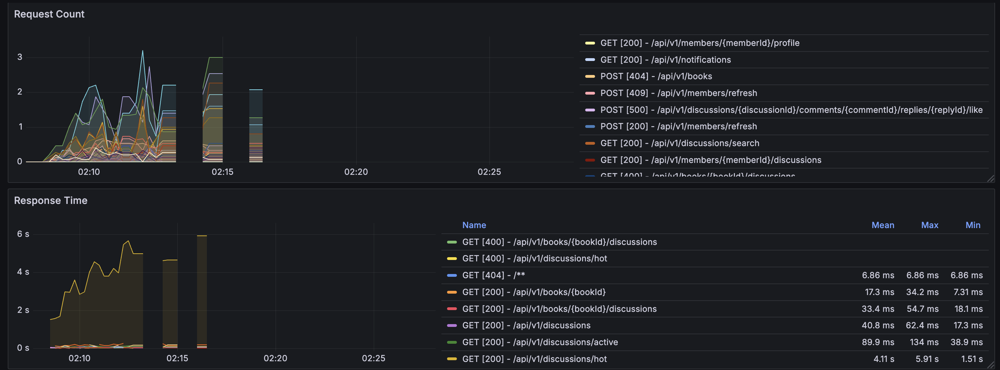
  <figcaption>그림 4-4: 2단계 테스트 응답 시간. 커넥션 타임아웃으로 인해 응답 시간이 급증합니다.</figcaption>
</figure>

- **현상:** 테스트 시작 직후 모든 요청이 실패하며 HikariCP 커넥션 풀 타임아웃이 발생했습니다.
- **원인 분석:** 대용량 데이터로 인해 기존 쿼리들이 **슬로우 쿼리**로 동작했고, 이들이 DB 커넥션을 장시간 점유하면서 전체 시스템이 마비되었습니다. 특히 '인기 토론방 조회' API가 가장 큰 병목이었습니다.

| 로그 | 해석                                                                                                                                                                                                                                                                                                                                                                                                                               |
| --- |--------------------------------------------------------------------------------------------------------------------------------------------------------------------------------------------------------------------------------------------------------------------------------------------------------------------------|
| [2025-11-03 22:19:00] [http-nio-8080-exec-5] ERROR [o.h.e.jdbc.spi.SqlExceptionHelper:150] - HikariPool-1 - Connection is not available, request timed out after 30000ms (total=5, active=5, idle=0, waiting=1) | 핵심 에러입니다.   • **`total=5`**: 현재 애플리케이션(Tomcat)에 설정된 DB 커넥션 풀(HikariCP)의 최대 크기가 **5개**입니다.   • **`active=5`**: 이 5개의 커넥션이 **모두 사용 중**입니다.   • **`idle=0`**: 대기(유휴) 중인 커넥션이 **하나도 없습니다.**   • **`waiting=1`**: **1개의 새로운 요청**(`http-nio-8080-exec-5` 스레드)이 커넥션을 받기 위해 대기 중이었습니다.   • **`request timed out after 30000ms`**: 이 새로운 요청은 30초(30,000ms) 동안 커넥션이 반납되기를 기다렸지만, 5개의 커넥션 중 아무것도 돌아오지 않아 결국 타임아웃 에러가 발생했습니다. |

 

### 2.3. 점진적 쿼리 개선 사이클

슬로우 쿼리 문제를 해결하기 위해 다음과 같은 반복적인 개선 사이클을 진행했습니다.

### [Cycle 1] 문제 재식별: 대규모 데이터 환경에서의 병목 발생

- **현상:** 테스트 시작 직후 모든 요청이 실패하며 Nginx에서 499(Client Closed Request) 오류 발생.
- **원인 분석:** 애플리케이션 로그 분석 결과, HikariCP 커넥션 풀 타임아웃이 확인되었습니다. 5개의 모든 DB 커넥션이 특정 슬로우 쿼리에 의해 30초 이상 점유되면서 후속 요청들이 커넥션을 할당받지 못해 전체 시스템이 마비되는 현상이었습니다. 근본 원인은 **DB 커넥션 반납 속도 < 신규 요청 유입 속도**였습니다.
- **병목 지점:** 데이터가 적을 때는 문제가 되지 않았던 '인기 토론방 조회' API가 가장 심각한 슬로우 쿼리를 유발하고 있었습니다.

 

### [Cycle 2] 쿼리 수 최적화: '인기 토론방 조회' API 개선

- **가설:** 해당 API가 요청당 7개의 쿼리를 실행하여 발생하는 과도한 **DB 네트워크 왕복 비용**이 성능 저하의 핵심 원인일 것이다.
- **개선 조치:** 여러 쿼리로 분산되어 있던 로직을 **DTO 프로젝션**을 활용하여 3개의 쿼리로 통합했습니다. 비정규화, OneToMany 관계 사용, 캐싱, Materialized View 사용 등의 방식을 고려하고 각각의 장단점과 러닝커브를 고려했을 때, 이 방식은 엔티티 수정 없이 필요한 데이터만 조회하여 데이터 정합성 문제에서 자유롭고, 즉시 도입이 가능하다는 장점이 있어서 선택했습니다.
- **결과:**
  - **성공:** 극심했던 커넥션 풀 고갈 현상이 해결되어 테스트가 정상적으로 완료되었습니다。
<figure>
  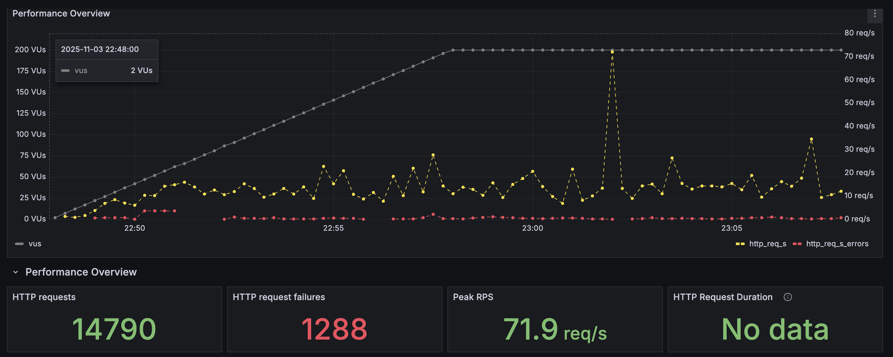
  <figcaption>그림 5-1: '인기 토론방 조회' API 쿼리 수 최적화 후 RPS. 커넥션 고갈 문제는 해결되었으나, RPS는 10-20 수준으로 여전히 낮습니다.</figcaption>
</figure>

  - **한계:** 평균 RPS는 10~20 수준에 머물렀고, 해당 API의 P95 응답 시간은 여전히 5초에 달했습니다. DB CPU 사용률은 100%에 육박하여 DB 자체가 새로운 병목이 되었습니다.

 

### [Cycle 3] 쿼리 복잡도 재조정: 과도한 통합 쿼리의 역효과

- **가설:** 네트워크 비용을 줄이기 위해 추가적으로 쿼리를 과도하게 통합한 결과, 단일 쿼리의 복잡도가 지나치게 높아져 오히려 DB에 큰 부하를 유발하고 있다.
- **개선 조치:** 모든 토론방 조회 API에 공통으로 적용했던 DTO 프로젝션 기반의 단일 집계 쿼리 로직을, **적절히 분리된 3개의 쿼리**로 다시 원복했습니다. 이는 '무거운 쿼리 하나'보다 '가벼운 쿼리 여러 개'가 더 효율적일 수 있다는 가설을 검증하기 위함이었습니다.
- **결과:**
  - **성공:** 평균 RPS가 20~40으로 개선되었고, DB CPU 사용률은 91%로 소폭 감소했습니다. '인기 토론방 조회' API의 평균 응답 시간은 1초 이하로 안정화되었습니다。
<figure>
  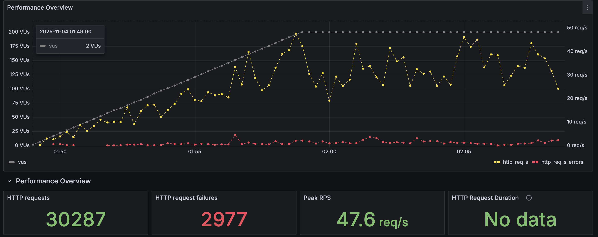
  <figcaption>그림 6-1: 쿼리 복잡도 재조정 후 RPS. 평균 RPS가 20-40으로 개선되었습니다.</figcaption>
</figure>
<figure>
  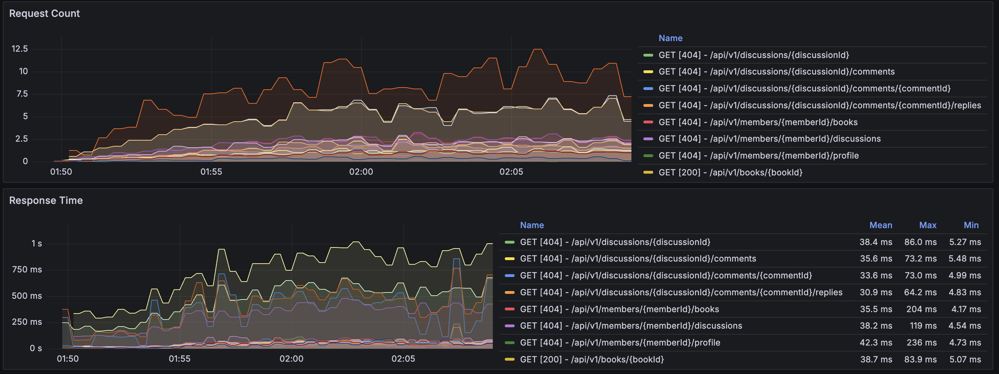
  <figcaption>그림 6-2: 쿼리 복잡도 재조정 후 평균 응답 시간. 주요 API의 평균 응답 시간이 1초 이하로 안정화되었습니다.</figcaption>
</figure>
  
- **추가 발견:** P95, P99와 같은 **꼬리 지연 시간(Tail Latency)** 지표를 확인한 결과, 평균 응답 시간에는 드러나지 않았던 다른 API들('회원별 참여 토론방 조회' 등)의 지연 문제가 발견되었습니다。
<figure>
  
  <figcaption>그림 6-3: P95 응답 시간. 평균 지표에서는 보이지 않던 심각한 꼬리 지연 시간이 존재함을 보여줍니다.</figcaption>
</figure>

 

### [Cycle 4] 쿼리 실행 계획 분석 및 인덱싱

- **가설:** 새롭게 발견된 슬로우 쿼리들은 인덱스가 없어 Full Scan이 발생하고 있을 것이다.
- **개선 조치:** `EXPLAIN ANALYZE`를 통해 '댓글+대댓글 수 집계' 쿼리의 실행 계획을 분석했습니다. 1:N 관계가 연쇄 조인되면서 발생하는 **팬아웃Fan-out**으로 인해 중간 데이터가 폭증하는 것을 확인했습니다. 이를 해결하기 위해 **커버링 인덱스**를 포함한 3개의 복합 인덱스를 추가하여 불필요한 데이터 접근을 최소화했습니다. 사전 집계, 임시테이블 사용, 스칼라 서브쿼리 등의 방식을 고려 및 시도했으나 JPA와의 호환성과 효과를 비교했을 때 인덱스 적용이 우선이라고 판단했습니다.
<figure>
  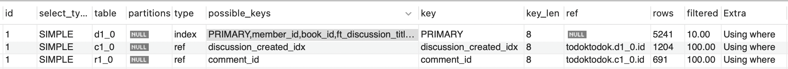
  <figcaption>그림 7-1: EXPLAIN 실행 계획 결과. type: index는 옵티마이저가 인덱스 전체를 스캔하고 있음을 의미하며, 이는 비효율의 원인이 됩니다.</figcaption>
</figure>

- **결과:**
  - **한계:** 예상과 달리 성능 개선 효과가 미미했습니다. RPS와 응답 시간 모두 이전 단계와 유사한 수준을 유지했습니다. 여전히 '회원별 참여 토론방 조회' 등의 지연 시간이 유사하게 소요되었습니다.
<figure>
  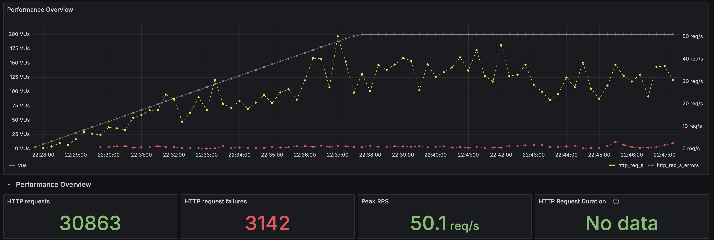
  <figcaption>그림 8-1: 인덱싱 적용 후 RPS. 예상과 달리 성능 개선 효과가 미미하여 RPS가 이전 단계와 유사합니다.</figcaption>
</figure>
<figure>
  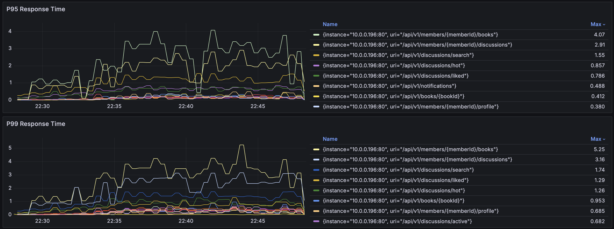
  <figcaption>그림 8-2: 인덱싱 적용 후 P95 응답 시간. 꼬리 지연 시간 문제 또한 해결되지 않았음을 보여줍니다.</figcaption>
</figure>

 

### [Cycle 5] 테스트 데이터의 편향성 문제 해결

- **가설:** 인덱스 추가에도 성능 개선이 없는 것은, 쿼리 자체가 아닌 **테스트 데이터의 극심한 편향** 때문일 것이다.
- **원인 분석:** 테스트 과정에서 생성된 10만 건 데이터의 대부분이 `member_id = 1` 한 명의 사용자에 의해 작성된 것을 발견했습니다. 이로 인해 '특정 회원 활동 조회' API 호출 시 사실상 전체 테이블을 스캔하는 것과 같은 비효율이 발생하고 있었습니다.
- **개선 조치:**
  1.  `member` 테이블에 3,000명의 사용자 데이터를 추가했습니다.
  2.  기존 10만 건 데이터의 `member_id`를 정규분포에 가깝게 재분배하여 데이터 편향을 해소했습니다.
  3.  부하 테스트 스크립트가 다양한 사용자 ID로 요청 및 데이터 생성을 하도록 수정했습니다.
- **결과:**
  - **성공:** 가장 극적인 성능 개선을 확인했습니다. '회원별 토론방/도서 조회' API의 P99 응답 시간이 최대 5초대에서 **1초 미만**으로 단축되었습니다. 슬로우 쿼리 발생 빈도가 현저히 감소했으며, DB CPU 사용률은 76.9%로 안정화되었습니다.

<figure>
  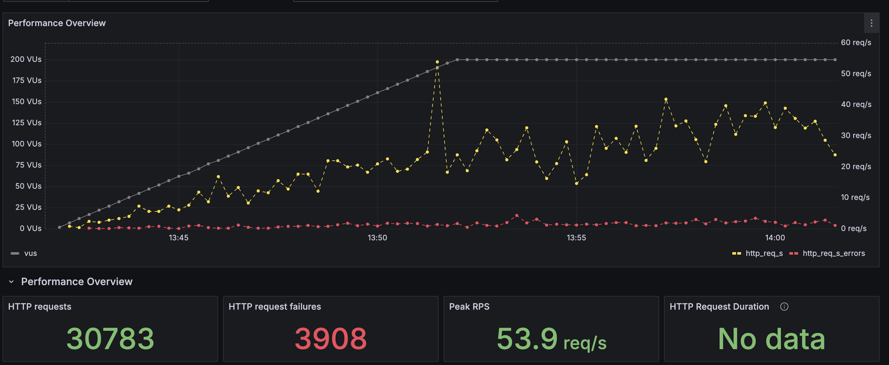
  <figcaption>그림 9-1: 데이터 편향성 해결 후 RPS. 평균 40 RPS를 안정적으로 처리하며 테스트가 성공적으로 수행되었습니다.</figcaption>
</figure>
<figure>
  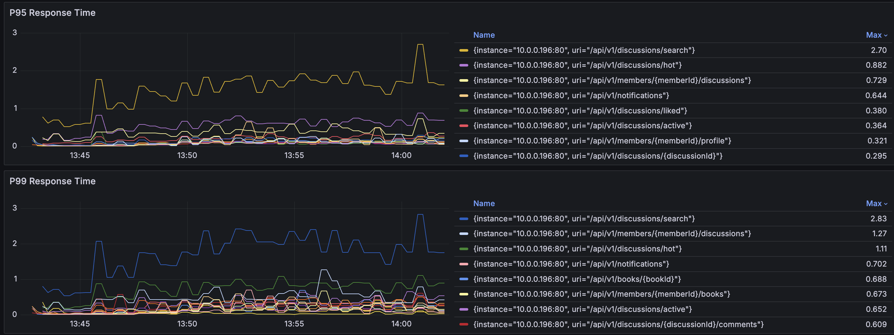
  <figcaption>그림 9-2: 데이터 편향성 해결 후 P95 응답 시간. P95 지표가 1초 미만으로 크게 개선되어 꼬리 지연 시간 문제가 해결되었음을 보여줍니다.</figcaption>
</figure>

 

---

## 최종 결론

### 성과 요약

체계적인 2단계 최적화 과정을 통해 **다음과 같은 변경을 적용했습니다.**

1. 인기 토론방 조회의 쿼리 개수 7 → 5개로 단축
2. 모든 토론방 조회의 쿼리 개수 2개 단축
3. 댓글 + 대댓글 집계 쿼리에 인덱스 3개 추가
4. 테스트 데이터에서 member 데이터 3000개로 증가 및 외래키 member_id에 균일 분포
5. 그라파나 모니터링 P95, P99, P100 & 슬로우쿼리 모니터링 추가하여 지연 API 추가 발견
6. 동시접속자 최대 200명 기준 최적의 톰캣 & HikariCP 튜닝 - 7개, 5개
7. 동시접속자 최대 600명 기준 최적의 Nginx 튜닝 - 1024개

**이를 통해 아래와 같은 개선을 했습니다.**

1. 평균 RPS 40까지 처리 가능하여, 목표 RPS(20) 안정적 보장
2. Nginx 커넥션 고갈, Mysql Timeout을 방지해, 병목 이후 모든 요청이 연쇄적으로 실패하는 최악의 상황 방지(10회 이상 재발하지 않음)
3. 인기 토론방 조회 시간 단축 (최대 평균 3.76s, P95 5.34s → 평균 0.366s, P95 0.857s)
4. 멤버별 토론방 시간 단축 (최대 평균 1.30s, P95 5.52s → 평균 0.232s, P95 0.814s)
5. 멤버별 도서 시간 단축 (최대 평균 1.01s, P95 5.01s → 평균 0.0508s, P95 0.362s)
6. 모든 토론방 조회 API의 지연 시간 1s~4s 단축

   - `/api/v1/discussions/search` 제외 모든 API의 지연 시간이 최대 4.5s 단축되었으며, 증가폭이 1s 이내로 안정적입니다. 최대 지연 시간도 1s 이하입니다.

   - `/api/v1/discussions/search` 포함 모든 API의 지연 시간을 3s 이하로 유지시켜 일반적인 웹 사용자가 대기할 수 있는 시간(최대 3초) 이하로 단축했습니다.

<figure>
  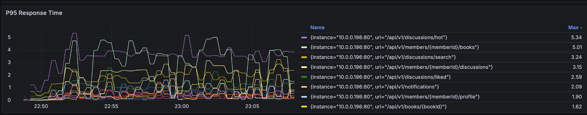
  <figcaption>그림 10-1: 최적화 전(After test 2) P95 응답 시간. 최대 5.34초의 심각한 지연이 발생했습니다.</figcaption>
</figure>
<figure>
  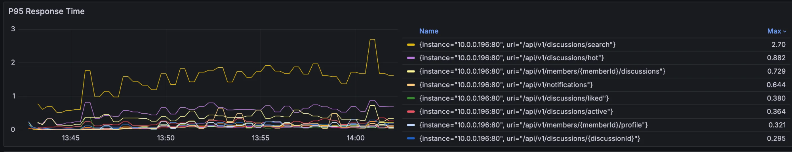
  <figcaption>그림 10-2: 최종 최적화 후(After test 5) P95 응답 시간. 최대 2.70초로 개선되었으며, 주요 병목 API들은 1초 미만으로 안정화되었습니다.</figcaption>
</figure>

7. DB CPU 사용률 감소 (100% → 78.8%)
8. 서버 CPU 사용률 40% 이하 유지

### 요약

| 지표 항목 | 개선 전 (Before) | 개선 후 (After) | 개선 효과 |
| :--- | :--- | :--- | :--- |
| 안정적 처리량 | ~10 RPS (DB 병목) | 평균 40 RPS | 약 4배 향상 |
| 멤버별 토론방 조회 (P95) | 5.52초 | 0.81초 | 85% 시간 단축 |
| 인기 토론방 조회 (P95) | 5.34초 | 0.85초 | 84% 시간 단축 |
| DB CPU 사용률 (피크) | 100% (포화) | 76.9% | 안정권 확보 |
| 장애 발생 임계점 | VU 600명 | VU 600명 이상 안정 | 장애 해결 |

 

### 핵심 교훈 (Key Takeaways)

1.  **End-to-End 분석의 중요성:** 성능 병목은 Nginx, WAS, DB 등 여러 시스템의 상호작용 속에서 발생하므로, 전체 요청 흐름을 종합적으로 분석해야 근본적인 해결이 가능합니다.
2.  **현실적인 테스트 시나리오의 가치:** 성능 문제는 실제와 유사한 데이터 분포와 사용자 시나리오 하에서만 정확히 드러납니다. 테스트 데이터의 편향성은 잘못된 분석과 비효율적인 최적화로 이어질 수 있습니다.
3.  **평균을 넘어선 꼬리 지연 시간 모니터링:** 평균 응답 시간은 잠재적인 성능 문제를 가릴 수 있습니다. P95, P99 지표를 통해 일부 사용자가 겪는 심각한 지연을 파악하고 개선해야 합니다.
4.  **데이터 기반의 반복적 개선:** 성능 튜닝은 단발성 작업이 아닙니다. '분석 → 가설 → 개선 → 검증'의 사이클을 반복하며 점진적으로 병목을 제거해 나가는 체계적인 접근이 필수적입니다.
