## 서론

---

이전에 부하테스트를 저희끼리 진행하면서, 스레드풀 튜닝 & 커텍션풀의 적정범위를 찾았지만, 데이터베이스 안에 대용량 데이터 삽입 후 재테스트하니 **테스트에 많은 문제를 발견**했었어요.

테스트 시나리오 자체의 개연성이 떨어져서 결과에 신뢰도가 없는 테스트도 있었고, 결과를 완전히 잘못 해석하거나 모순되는 해석도 있었고, 개선사항만 남겨놓은채 원인만 파악하고 테스트가 끝나기도 했어요.

특히 험난한 테스트가 끝나니 `병목을 해결하려면 슬로우 쿼리를 개선해야 한다!` 라는 결론이 나왔는데요, 실질적으로 개선한 건 없다보니 이걸로 끝이라는 생각도 안 들더라구요.

그래서 저는 부하테스트를 조금 더 집요하게 해보았어요. 해보다보니 우리 테스트에서 부족했던 부분이 많이 눈에 보였고, 그동안의 경험이 있다보니 원인이 더 잘 유추되었어요. 그래서 한발한발 해결하는 맛이 있더라구요!

이번에는 RDD의 목적도 있었고, 각자 일정이 있다보니 혼자서 퍼포먼스 서버에서 열심히 수정해보며 진행했습니다.

한번 읽어보고, 개선의 중요성이 느껴진다면 여러분도 한 3일 잡고 여러분의 스타일로 땅끝까지 개선! 하면서 놀아봐도 좋을 것 같습니다.

(참고로 부하테스트 다시 하신다면 말씀해주세요! 제가 갖고 노느라 DB도 많이 차있고, 코드 수정이 정말정말 많아서 원래 코드로 원복한뒤 원하는 대로 수정하시면 될 것 같아요,)

## 부하테스트의 중요성

---

토독토독은 아직 사용자 30명 (런칭때 열심히 모아놓은..) 에 불과한 서비스예요.

사용자를 열심히 모아서 100명, 1000명이 되더라도 사실 `실시간 토론방 만들어줘요!` `이건 왜 없어요?` `앱이 갑자기 꺼져요!` `회원가입이 안돼요!` `똥글 지워줘요!`와 같은 피드백만 잔뜩 쌓일 것 같아요 ㅋㅋ 경험담임

실질적으로 백엔드가 유저 피드백을 바탕으로 서버의 성능을 개선하려 해도, 서버 성능에 영향을 미칠 정도의 부하가 생기는 건… 쉽지 않죠.

**그래서 부하테스트가 생각 이상으로 중요한 것 같아요.**

사용자가 없어도 **우리 서비스는 건강하다**, **백엔드는 준비가 되었다**를 증명할 수 있는 상황과 지표를 만들어내는 방식이니까요.

그래서 우리의 부하테스트 결과에 `이거 정말 성능 개선된 거 맞아?` `왜 rps는 그대로인데 응답 시간은 안좋아졌어?` `개선됐다고 했는데, 응답 시간이 5초인데?` `왜 쿼리는 2초가 찍히는데 너희 응답시간은 1초야?` 와 같은 의문을 최소화하고, 정말 실제로 일어날 수 있는 상황을 가정하고 그 상황에서 우리 서버가 잘 버틸 거라는 신뢰를 보여주는 것이 이번 개선의 목표였습니다.

## 우리의 목표 RPS

---

솔라의 피드백 중 우리가 놓친 핵심은 아래와 같다고 생각했어요.

> 🌞 : 1순위 목적은 서비스에서 서버가 안정적으로 처리할 수 있는 TPS를 대략 확인하는 것! 서버 1대의 최대 성능 지점을 연구하는 목적이 아님!
>

사실 우리도 나름 근거있게 목표치를 정했지만, 테스트 결과가 자꾸 예상과 달라지니 계속해서 `이 정도 수치도 견디는가?` `이래도 안견뎌?` 가 우선순위가 됐던 것 같아요.

더불어서 큰 근거 없이 MAU는 3000명 정도로 잡고, 목표 TPS를 처음엔 무려 300, 그뒤로도 우리 서버의 한계치에 맞춰 150-190 정도로 때려잡은 것도 아쉬운 포인트였던 것 같아요.

그래서 다소 사후적이지만, 나름의 근거로 우리의 목표 RPS를 다시 잡아보았습니다.

목표 MAU(월 평균 활성 사용자수)를 정한다고 바로 목표 RPS를 정하는 건 **상당히 비약적**이에요.

크게 4가지를 고려해볼 수 있습니다.

| 고려사항 | **변수 예시** |
| --- | --- |
| 한 달 동안의 **총 사용자 수** | MAU = 3,000 |
| 사용자 1명이 하루에 접속하는 **빈도** | 평균 0.5~1회/일 |
| 한 번 접속할 때 발생하는 **요청 수** | 평균 10~30 요청 |
| 접속이 몰리는 시간대(트래픽 집중률) 고려 | 피크 타임 비율 5~10배 |

그리고 각 단계에서 잡을 값은 정해져있는 게 아니예요. 4달 간 우리 서비스를 만들면서 터득한 **우리 서비스의 트래픽 특성을 고려해** 잡아야 합니다.

우리 서비스는

- 커뮤니티면서
- 토론 서비스

입니다.

사용자가 하루에도 몇 번씩 토론을 이어가기 위해 **짧지만 잦은 재방문률이 높은 서비스**라고 생각했습니다.

또한 많은 트래픽이 **조회 중심**이라고 생각했어요.

그럼 이를 고려해서 RPS를 뽑아봅시다.

- 월평균방문자 (MAU) = `3000`명 (프리코스 홍보 기간 고려)
- 하루평균방문자 (DAU) = 약 30% (커뮤니티 서비스이므로 높게 잡음) = `900`명
- 1명당 하루 평균 `5`회 접속 (출퇴근 시간 & 알람 올 때 토론 확인)
- 1회 접속 시 평균 `30`개의 요청 발생(메인 페이지 로드, 토론방 목록 조회, 몇개의 토론방 조회 등)

👉 하루 총 요청 수 = 900명 * 5회 * 30개 = `135,000`건

이렇게 하루 안에 발생할 수 있는 요청을 예측해봤어요.

다음은 요청 횟수를 RPS로 바꿔봅시다.

`RPS = 총 처리한 요청 수 / Sec`이죠. 앞단계에서 하루 안에 처리할 것이라고 예상되는 요청 건수 견적을 잡았으니, 이를 sec로 나누기만 하면 돼요.

- 하루 중 트래픽이 거의 없을 0-6시 제외 18시간 = 64,800초
- 평균 RPS = 135,000 / 64,800 ≈ **`2.08`** RPS

평균적으로 2.08 RPS면 개선할 게 너무 없지 않나요?

그러나 이는 18시간 내내 일정한 분포로 요청이 발생할 때의 RPS에요.

일반적으로 트래픽은 **특정 시간대에 몰립니다**.

우리 서비스의 경우 크게 예측할 순 없지만, 우리도 역시 일과시간 보다는 출퇴근시간, 잠들기 전, 재밌는 토론이 이어질 때 등등의 시간에 트래픽이 몰릴 순 있겠죠?

이는 정확히 잡을 수 없지만, 일반적으로 **평균 RPS의 5~10배**를 피크치로 잡는다고 합니다.

그렇게 되면

<aside>

피크 RPS = 2.08 * 10 = **`20.8`** RPS

</aside>

를 목표 TPS로 잡을 수 있겠습니다.

## 본격적인 부하테스트 재시작

---

그럼 이제 다시 부하테스트 공장을 가동해볼게요.

부하테스트 전에는 **최대한 Before의 사양을 잘 기록해 둡시다.**

테스트 결과보다 중요한 건, 어떤 상황에서 테스트했고 그 테스트 상황이 얼마나 개연성 있는가? 즉 이 테스트의 신뢰도니까요!

<aside>

- 서버
    - 애플리케이션 : t4g.small (vCPU : 2, 메모리 : 2GiB)
    - 리버스 프록시 : t4g.nano (vCPU : 2, 메모리 : 0.5GiB)
    - 테스트 요청 흐름
      
    - 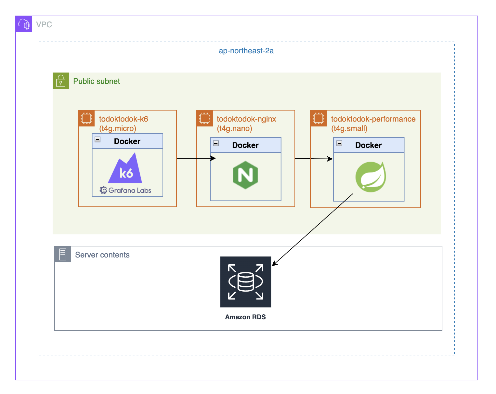

- DB : 핵심 데이터 **10만건**
    - `comment` 21576
    - `comment_like` 5239
    - `discussion` 5745
    - `discussion_like` 4298
    - `discussion_member_view` 3756
    - `notification` 40073
    - `notification_token` 4407
    - `refresh_token` 6076
    - `reply` 21835
    - `reply_like` 28
- Hikaricp maxConnection : **7**
- tomcat maxThread : **5**
- Nginx workerConnection : **1024**
- VUs : 0 → **200** (10분동안 상승, 10분동안 유지)
    - 한 VU당(think time 10초 + 지연시간에 한번~= 약 11초) 1~5회, 평균 **2.5회** 요청 보냄
- 테스트 스크립트 : 가중치 테스트 (POST 요청 제외 GET 요청만 보낸다.)
    - 테스트 스크립트

        ```jsx
        import http from 'k6/http';
        import { sleep, group, check } from 'k6';
        
        export const options = {
          stages: [
            { duration: '10m', target: 200 },
            { duration: '10m', target: 200 },
          ],
        };
        
        const BASE = 'http://43.202.235.126';
        const JSON_HEADERS = { headers: { 'Content-Type': 'application/json' } };
        
        // ID 범위 정의
        // const RANGES = {
        //   memberId: { min: 1, max: 8 },
        //   discussionId: { min: 1, max: 16 },
        //   commentId: { min: 1, max: 29 },
        //   replyId: { min: 1, max: 1 },
        //   bookId: { min: 1, max: 25 },
        // };
        
        const RANGES = {
          memberId: { min: 1, max: 8 },
          discussionId: { min: 1, max: 5000 },
          commentId: { min: 1, max: 20000 },
          replyId: { min: 1, max: 20000 },
          bookId: { min: 1, max: 25 },
        };
        
        // ===== 유틸 =====
        function randInt(min, max) {
          return Math.floor(Math.random() * (max - min + 1)) + min;
        }
        function pickId(key) {
          const { min, max } = RANGES[key];
          return randInt(min, max);
        }
        function nowStr() {
          return new Date().toISOString();
        }
        function ok(res) {
          return res && res.status && res.status < 500;
        }
        function pick(arr) {
          return arr[Math.floor(Math.random() * arr.length)];
        }
        function randomIsbn13() {
          // 단순 13자리 숫자형 ISBN 생성(형식 감시 정도에 충분)
          const prefix = '978';
          const body = String(randInt(10 ** 9, 10 ** 10 - 1)).padStart(10, '0'); // 10자리
          return prefix + body; // 13자리
        }
        
        // 예쁜 값들
        const K_TITLES = [
          '객체지향의 사실과 오해', '클린 코드', '모던 자바 인 액션', '이펙티브 자바',
          '리팩터링 2판', '데이터 중심 애플리케이션 설계', 'HTTP 완벽 가이드', '가상 면접 사례로 배우는 대규모 시스템 설계'
        ];
        const K_AUTHORS = ['박재성', '로버트 C. 마틴', '조슈아 블로크', '마틴 파울러', '반 버넌', '토마스 피에츠첸'];
        const DEVICES = ['web', 'ios', 'android'];
        
        // 케이스 목록 (가중치 포함)
        const cases = [
          // 1. 가중치 5 [토론방 최신순 조회] - 동일 요청 5회
          {
            name: '토론방 최신순 조회 x5',
            weight: 5,
            run: () => {
              const url = `${BASE}/api/v1/discussions?size=5`;
              for (let i = 0; i < 5; i++) {
                const r = http.get(url);
                check(r, { '1.latest.ok': (res) => ok(res) });
              }
            },
          },
        
          // 2. 가중치 3 [토론방 검색]
          {
            name: '토론방 검색',
            weight: 3,
            run: () => {
              const url = `${BASE}/api/v1/discussions/search?keyword=${encodeURIComponent('객체')}`;
              const r = http.get(url);
              check(r, { '2.search.ok': (res) => ok(res) });
            },
          },
        
          // 3. 가중치 3 [회원 관련 조회 연쇄]
          {
            name: '회원 프로필/책/좋아요/참여 조회',
            weight: 3,
            run: () => {
              const memberId = pickId('memberId');
        
              let r = http.get(`${BASE}/api/v1/members/${memberId}/profile`);
              check(r, { '3.profile.ok': (res) => ok(res) });
        
              r = http.get(`${BASE}/api/v1/members/${memberId}/books`);
              check(r, { '3.books.ok': (res) => ok(res) });
        
              r = http.get(`${BASE}/api/v1/discussions/liked?size=10`);
              check(r, { '3.liked.ok': (res) => ok(res) });
        
              r = http.get(`${BASE}/api/v1/members/${memberId}/discussions?type=PARTICIPATED`);
              check(r, { '3.participated.ok': (res) => ok(res) });
            },
          },
        
          // 4. 가중치 7 [메인화면 조회]
          {
            name: '메인화면 조회',
            weight: 7,
            run: () => {
              // let r = http.get(`${BASE}/api/v1/discussions/hot?period=7&count=10`);
              // check(r, { '4.hot.ok': (res) => ok(res) });
        
              let r = http.get(`${BASE}/api/v1/discussions/active?period=7&size=10`);
              check(r, { '4.active.ok': (res) => ok(res) });
            },
          },
        
          // 5. 가중치 3 [토론방 생성 → 도서 생성]
          // {
          //   name: '토론방/도서 생성',
          //   weight: 3,
          //   run: () => {
              // const bookId = pickId('bookId');
              // const discussionTitle = `[k6] ${pick(K_TITLES)} (${nowStr()})`;
              // const discussionOpinion = '성능 검증용 자동 생성 의견입니다. 실제 데이터와 혼동하지 마세요.';
              // const r1 = http.post(
              //   `${BASE}/api/v1/discussions`,
              //   JSON.stringify({
              //     bookId: bookId,
              //     discussionTitle: discussionTitle,
              //     discussionOpinion: discussionOpinion,
              //   }),
              //   JSON_HEADERS
              // );
              // check(r1, { '5.discussion.post.ok': (res) => ok(res) });
        
          //     const bookTitle = `[k6] ${pick(K_TITLES)} #${randInt(1, 999)}`;
          //     const bookAuthor = pick(K_AUTHORS);
          //     const isbn13 = randomIsbn13();
          //     // 보기 좋은 샘플 이미지 URL
          //     const imageUrl = `https://picsum.photos/seed/${isbn13.slice(-6)}/300/450`;
        
          //     const r2 = http.post(
          //       `${BASE}/api/v1/books`,
          //       JSON.stringify({
          //         bookIsbn: isbn13,
          //         bookTitle: bookTitle,
          //         bookAuthor: bookAuthor,
          //         bookImage: imageUrl,
          //       }),
          //       JSON_HEADERS
          //     );
          //     check(r2, { '5.book.post.ok': (res) => ok(res) });
          //   },
          // },
        
          // 6. 가중치 10 [토론 단일 조회 → 댓글목록 → 댓글 생성]
          {
            name: '토론 단일/댓글 조회+생성',
            weight: 10,
            run: () => {
              const discussionId = pickId('discussionId');
        
              let r = http.get(`${BASE}/api/v1/discussions/${discussionId}`);
              check(r, { '6.discussion.get.ok': (res) => ok(res) });
        
              r = http.get(`${BASE}/api/v1/discussions/${discussionId}/comments`);
              check(r, { '6.comments.get.ok': (res) => ok(res) });
        
              // r = http.post(
              //   `${BASE}/api/v1/discussions/${discussionId}/comments`,
              //   JSON.stringify({ content: `k6 댓글: ${nowStr()}` }),
              //   JSON_HEADERS
              // );
              // check(r, { '6.comment.post.ok': (res) => ok(res) });
            },
          },
        
          // 7. 가중치 10 [토론/댓글/대댓글 조회+생성]
          {
            name: '토론/댓글/대댓글 조회+생성',
            weight: 10,
            run: () => {
              const discussionId = pickId('discussionId');
              const commentId = pickId('commentId');
        
              let r = http.get(`${BASE}/api/v1/discussions/${discussionId}`);
              check(r, { '7.discussion.get.ok': (res) => ok(res) });
        
              r = http.get(`${BASE}/api/v1/discussions/${discussionId}/comments`);
              check(r, { '7.comments.get.ok': (res) => ok(res) });
        
              r = http.get(`${BASE}/api/v1/discussions/${discussionId}/comments/${commentId}`);
              check(r, { '7.comment.get.ok': (res) => ok(res) });
        
              r = http.get(`${BASE}/api/v1/discussions/${discussionId}/comments/${commentId}/replies`);
              check(r, { '7.replies.get.ok': (res) => ok(res) });
        
              // r = http.post(
              //   `${BASE}/api/v1/discussions/${discussionId}/comments/${commentId}/replies`,
              //   JSON.stringify({ content: `k6 대댓글: ${nowStr()}` }),
              //   JSON_HEADERS
              // );
              // check(r, { '7.reply.post.ok': (res) => ok(res) });
            },
          },
        
          // 8. 가중치 2 [알람 fcmToken 발급]
        	// {
        	//   name: '알람 토큰 발급',
        	//   weight: 2,
        	//   run: () => {
        	//     const token = `k6-${Math.random().toString(36).slice(2)}-${Date.now()}`;
        	//     // 실제 FCM Installation ID 형식: 22~28자 base64url 비슷한 문자열
        	//     const fid = Math.random().toString(36).substring(2, 15) + Math.random().toString(36).substring(2, 15);
        	
        	//     const r = http.post(
        	//       `${BASE}/api/v1/notificationTokens`,
        	//       JSON.stringify({ token: token, fid: fid }),
        	//       JSON_HEADERS
        	//     );
        	//     check(r, { '8.fcm.post.ok': (res) => ok(res) });
        	//   },
        	// },
        
          // 9. 가중치 1 [로그인]
          // {
          //   name: '로그인',
          //   weight: 1,
          //   run: () => {
          //     const r = http.post(
          //       `${BASE}/api/v1/members/login`,
          //       JSON.stringify({ googleIdToken: 'chaeyoung0714@gmail.com' }),
          //       JSON_HEADERS
          //     );
          //     check(r, { '9.login.post.ok': (res) => ok(res) });
          //   },
          // },
        
          // 10. 가중치 5 [토론 좋아요]
          // {
          //   name: '토론 좋아요',
          //   weight: 5,
          //   run: () => {
          //     const discussionId = pickId('discussionId');
          //     const r = http.post(
          //       `${BASE}/api/v1/discussions/${discussionId}/like`,
          //       null,
          //       JSON_HEADERS
          //     );
          //     check(r, { '10.discussion.like.ok': (res) => ok(res) });
          //   },
          // },
        
          // 11. 가중치 5 [댓글 좋아요]
          // {
          //   name: '댓글 좋아요',
          //   weight: 5,
          //   run: () => {
          //     const discussionId = pickId('discussionId');
          //     const commentId = pickId('commentId');
          //     const r = http.post(
          //       `${BASE}/api/v1/discussions/${discussionId}/comments/${commentId}/like`,
          //       null,
          //       JSON_HEADERS
          //     );
          //     check(r, { '11.comment.like.ok': (res) => ok(res) });
          //   },
          // },
        
          // 12. 가중치 5 [대댓글 좋아요]
          // {
          //   name: '대댓글 좋아요',
          //   weight: 5,
          //   run: () => {
          //     const discussionId = pickId('discussionId');
          //     const commentId = pickId('commentId');
          //     const replyId = pickId('replyId');
          //     const r = http.post(
          //       `${BASE}/api/v1/discussions/${discussionId}/comments/${commentId}/replies/${replyId}/like`,
          //       null,
          //       JSON_HEADERS
          //     );
          //     check(r, { '12.reply.like.ok': (res) => ok(res) });
          //   },
          // },
        
          // 13. 가중치 3 [도서 상세/토론방 조회]
          {
            name: '도서 상세/토론방 조회',
            weight: 3,
            run: () => {
              const bookId = pickId('bookId');
        
              let r = http.get(`${BASE}/api/v1/books/${bookId}`);
              check(r, { '13.book.get.ok': (res) => ok(res) });
        
              r = http.get(`${BASE}/api/v1/books/${bookId}/discussions?size=10`);
              check(r, { '13.book.discussions.get.ok': (res) => ok(res) });
            },
          },
        
          // 14. 가중치 1 [알람 목록 조회]
          {
            name: '알람 목록 조회',
            weight: 1,
            run: () => {
              const r = http.get(`${BASE}/api/v1/notifications`);
              check(r, { '14.notifications.get.ok': (res) => ok(res) });
            },
          },
        
          // 15. 가중치 3 [리프레시 토큰 재발급]
          // {
          //   name: '리프레시 토큰 재발급',
          //   weight: 3,
          //   run: () => {
          //     const token = `rt-${Math.random().toString(36).slice(2)}-${Date.now()}`;
          //     const r = http.post(
          //       `${BASE}/api/v1/members/refresh`,
          //       JSON.stringify({ refreshToken: token }),
          //       JSON_HEADERS
          //     );
          //     check(r, { '15.refresh.post.ok': (res) => ok(res) });
          //   },
          // },
        ];
        
        // 가중치 기반 선택 함수
        const totalWeight = cases.reduce((s, c) => s + c.weight, 0);
        function pickCase() {
          let r = Math.random() * totalWeight;
          for (const c of cases) {
            if (r < c.weight) return c;
            r -= c.weight;
          }
          return cases[cases.length - 1];
        }
        
        // 실제 시나리오 실행
        export default function () {
          group('다양한 API 테스트', function () {
            const chosen = pickCase();
            group(`케이스: ${chosen.name}`, function () {
              chosen.run();
            });
          });
        
          // 각 VU 루프 간 간격
          sleep(10);
        }
        ```

</aside>

직전 테스트의 상황을 복기해보자면,

- 데이터베이스에 데이터를 충분히 넣어놓고 테스트하면 성능이 훨씬 안좋아진다.
- 핵심 데이터 10만건 삽입 기준 슬로우쿼리 (**0.9초 이상**)가 많이 발견되었다.

이 상황이 현재에도 그대로 재현되는지, 현상황 그대로 테스트를 한번 돌려보는 걸 추천합니다.

부하테스트는 오래 걸리는데 한번 가정을 잘못하면 이전 테스트들이 쓸모 없어지는 경우가 많아요, 한번 한번 잘 확인하고 진행하는 게 좋은 것 같습니다.

## Before Test

---

- **테스트 (11/3 22:16:00 - 22:34:00)**

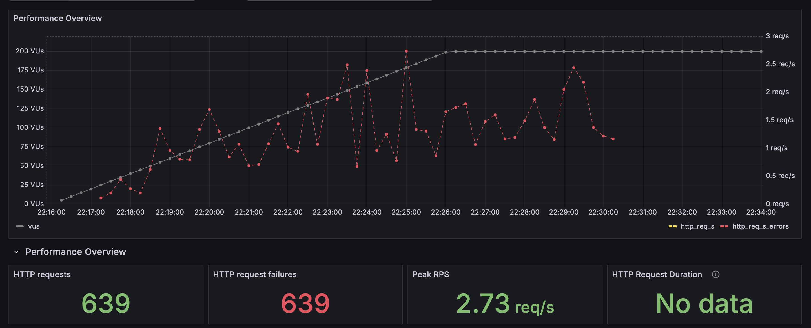
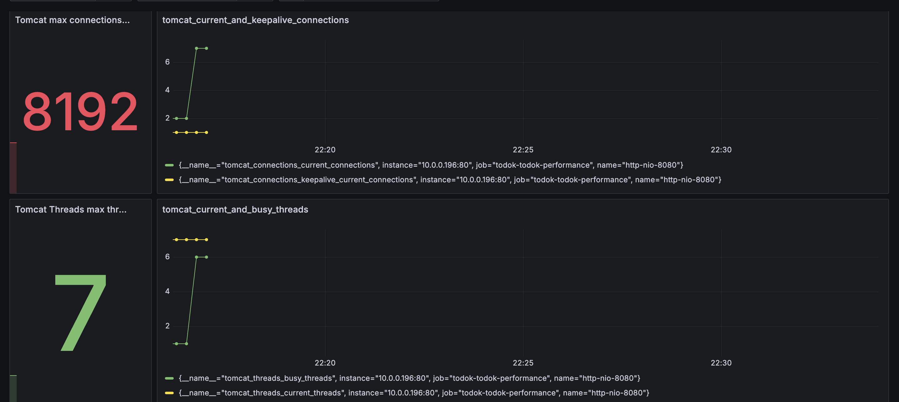

시작하자마자 문제가 생깁니다. 요청이 단 한 건도 성공하지 못하고, Nginx에는 **499(Connection timeout)**이 떠요.

우리는 이 상황을 이미 겪었었기 때문에 문제를 알고 있습니다. 로그를 수집해볼게요.

| 순서 | 로그 | 해석                                                                                                                                                                                                                                                                                                                                                                                                                               |
| --- | --- |----------------------------------------------------------------------------------------------------------------------------------------------------------------------------------------------------------------------------------------------------------------------------------------------------------------------------------------------------------------------------------------------------------------------------------|
| 1 | [2025-11-03 22:18:31] [http-nio-8080-exec-1] INFO [t.b.g.interceptor.LogInterceptor:29] - [API **REQUEST**] [54.180.146.78] GET /api/v1/discussions/hot?period=7&count=10 | 일단 애플리케이션으로 요청이 오긴 합니다.                                                                                                                                                                                                                                                                                                                                                                                                          우리의 대표적인 병목 API예요. |
| 2 | [2025-11-03 22:19:00] [http-nio-8080-exec-5] WARN [o.h.e.jdbc.spi.SqlExceptionHelper:145] - SQL Error: 0, SQLState: null |                                                                                                                                                                                                                                                                                                                                                                                                                                  |
| 3 | [2025-11-03 22:19:00] [http-nio-8080-exec-5] ERROR [o.h.e.jdbc.spi.SqlExceptionHelper:150] - HikariPool-1 - Connection is not available, request timed out after 30000ms (total=5, active=5, idle=0, waiting=1) | 핵심 에러입니다. <br> • **`total=5`**: 현재 애플리케이션(Tomcat)에 설정된 DB 커넥션 풀(HikariCP)의 최대 크기가 **5개**입니다. <br> • **`active=5`**: 이 5개의 커넥션이 **모두 사용 중**입니다. <br> • **`idle=0`**: 대기(유휴) 중인 커넥션이 **하나도 없습니다.** <br> • **`waiting=1`**: **1개의 새로운 요청**(`http-nio-8080-exec-5` 스레드)이 커넥션을 받기 위해 대기 중이었습니다. <br> • **`request timed out after 30000ms`**: 이 새로운 요청은 30초(30,000ms) 동안 커넥션이 반납되기를 기다렸지만, 5개의 커넥션 중 아무것도 돌아오지 않아 결국 타임아웃 에러가 발생했습니다. |
| 4 | [2025-11-03 22:19:00] [http-nio-8080-exec-5] ERROR [t.b.g.e.GlobalExceptionHandler:132] - Unexpected error occurred: org.springframework.transaction.CannotCreateTransactionException: Could not open JPA EntityManager for transaction |                                                                                                                                                                                                                                                                                                                                                                                                                                  |
| 5 | [2025-11-03 22:19:00] [http-nio-8080-exec-5] ERROR [t.b.g.interceptor.LogInterceptor:50] - [API **RESPONSE**] [54.180.146.78] GET -> /api/v1/discussions/4985: 500 | 500 응답으로 마무리됩니다.                                                                                                                                                                                                                                                                                                                                                                                                                 |

즉, 처음부터 슬로우쿼리가 발생했고, 빠르게 5개 커넥션 모두 슬로우쿼리가 차지해버립니다. (슬로우쿼리가 너무 빈번한 탓이겠죠)

새로운 요청은 커넥션을 기다리지만, 빠르게 병목이 차면서 30초 타임아웃이 발생해요. 이는 Mysql 측에서 나는 에러일 겁니다.

병목이 쌓이면서 뒤로 갈수록 요청은 더욱 느려지고, 빠르게 처리될 수 있는 API도 악순환으로 계속 실패합니다. Prometheus에서 15초마다 보내는 요청도 처리가 느려져서 Grafana에는 로그가 찍히지 않아요.

👉 이 현상의 근본적인 원인은 "**커넥션을 반납하는 속도보다 요청하는 속도가 더 빠르다**"는 것입니다. 5개의 커넥션이 모두 `30초 이상` 무언가에 붙잡혀 있었다는 뜻입니다.

**문제**

`문제는 쿼리` 라는 건 여전하다는 걸 알 수 있어요.

이전 테스트에서 인기 토론방 조회 요청이 가장 심각하게 느리다는 건 이미 파악했기 때문에, 당장 인기 토론방 조회 요청의 쿼리부터 개선해보겠습니다.

## Refactor 1

---

**해결**

인기 토론방 요청의 병목의 이유는 두 가지 후보가 있어요.

- 인기 토론방을 찾는 쿼리가 너무 복잡하다 ❌

  → **아닙니다**. 오히려 인기 토론방은 개별 쿼리의 복잡성을 크게 줄이고, 쿼리 수를 늘렸어요. 때문에 우리가 인덱스 미션에서 개별 쿼리 단위로 성능 테스트를 했을 땐 인기 토론방 쪽은 크게 문제가 되지 않았죠.

- 인기 토론방 조회 로직의 쿼리가 너무 많다. ✅

  → **문제는 이것입니다**. 무려 **7개**의 쿼리가 보내지고 있었어요.

    1. 멤버 조회
    2. 모든 토론방 ID 조회
    3. 모든 토론방에 대한 좋아요수 조회
    4. 모든 토론방에 대한 댓글+대댓글수 조회
    5. 인기 토론방들에 대한 댓글&대댓글수 조회
    6. 인기 토론방들에 대한 좋아요수&내가 좋아요한 여부 조회
    7. 인기 토론방 ID들에 대한 인기 토론방 객체 조회

  배치 쿼리를 써서 최소화했지만 그래도 무척 많은 수준입니다.

  일반적으로 쿼리는 1~2개가 가장 적절하고, 3~5개는 허용, 그 이상은 반드시 개선할 수준입니다.

  7개의 쿼리를 매 요청마다 보낼 경우 **서버와 DB 간의 네트워크 왕복 비용이 매우 높아집니다**.


따라서 쿼리 수를 대폭 줄여보는 것을 해결책으로 선택했습니다.

정말 대폭 줄여서 **3개**로 줄였어요.

(맘같아선 1개로 줄여보고 싶었지만, 카디널리티가 폭증할 것 같고 유지보수가 너무 어려울 것 같았습니다.)

1. Member 조회
2. hotDiscussionIds 조회
3. 모든 hotDisucssionIds에 대해 토론방엔티티, 댓글수, 좋아요수, 내가 좋아요한 여부를 계산해 Dto로 반환 (**DTO 프로젝션**)

Member 조회 로직은 어쩔 수 없어서 내버려두고, 기존의 2~4번 쿼리를 하나로 합쳤습니다. 또한 5~7번 쿼리는 모든 토론방 조회 로직에서 공통으로 사용하는 로직이에요. 따라서 이렇게 3갈래로 나누어 쿼리로 합쳤습니다.

```java
	public List<DiscussionResponse> getHotDiscussions(
	        final Long memberId,
	        final int period,
	        final int count
	) {
	    validateDiscussionPeriod(period);
	    validateHotDiscussionCount(count);
	
	    // 쿼리 수 감소 진행
	    final Member member = findMember(memberId); //1회
	    final LocalDateTime sinceDate = LocalDate.now().minusDays(period).atStartOfDay();
	    final Pageable pageable = PageRequest.of(0, count);
	
	    final List<Long> hotDiscussionIds = discussionRepository.findHotDiscussionIds(sinceDate, pageable); //2회
	
	    return getDiscussionsResponses(hotDiscussionIds, member);
	}
	
	 @Query("""
            SELECT d.id
            FROM Discussion d
            LEFT JOIN DiscussionLike dl ON dl.discussion = d AND dl.createdAt >= :sinceDate
            LEFT JOIN Comment c ON c.discussion = d AND c.createdAt >= :sinceDate
            LEFT JOIN Reply r ON r.comment = c AND r.createdAt >= :sinceDate
            GROUP BY d.id
            ORDER BY (COUNT(DISTINCT dl.id) + COUNT(DISTINCT c.id) + COUNT(DISTINCT r.id)) DESC, d.id DESC
        """)
    List<Long> findHotDiscussionIds(@Param("sinceDate") final LocalDateTime sinceDate, final Pageable pageable);
```

```java
	private List<DiscussionResponse> getDiscussionsResponses(
	        final List<Long> discussionIds,
	        final Member member
	) {
	    if (discussionIds.isEmpty()) {
	        return List.of();
	    }
	
	    final Map<Long, DiscussionResponse> responsesById = discussionRepository.findDiscussionResponses(discussionIds, //3회
	                    member).stream()
	            .collect(Collectors.toMap(DiscussionResponse::discussionId, response -> response));
	
	    return discussionIds.stream()
	            .map(responsesById::get)
	            .toList();
	}
	
  @Query("""
	        SELECT new todoktodok.backend.discussion.application.dto.response.DiscussionResponse(
	            d.id,
	            d.title,
	            d.content,
	            d.createdAt,
	            d.viewCount,
	            d.book,
	            d.member,
	            (SELECT COUNT(dl.id) FROM DiscussionLike dl WHERE dl.discussion = d),
	            (SELECT COUNT(c.id) FROM Comment c WHERE c.discussion = d) + (SELECT COUNT(r.id) FROM Reply r WHERE r.comment.discussion = d),
	            EXISTS(SELECT 1 FROM DiscussionLike dl2 WHERE dl2.discussion = d AND dl2.member = :member)
	        )
	        FROM Discussion d
	        LEFT JOIN d.book b
	        LEFT JOIN d.member m
	        WHERE d.id IN :discussionIds
	        """)
	List<DiscussionResponse> findDiscussionResponses(
	        @Param("discussionIds") final List<Long> discussionIds,
	        @Param("member") final Member member
	);
```

## 🍎 왜 DTO 프로젝션을 사용했는가?

---

핵심적으로 줄여야 하는 건 기존의 **5~7번 쿼리**, 즉 모든 토론방 조회 로직마다 댓글+대댓글수, 좋아요수, 내가 좋아요한 여부를 복잡한 쿼리로 불러오는 부분이라는 것이라고 생각했습니다.

이를 해결하려면 여러 방법이 있었어요.

1.  Discussion 엔티티에 좋아요/댓글+대댓글 수 필드 추가 (비정규화)

    > 이미 조회수를 구하기 위해 사용하는 방식이죠.
2. Discussion 엔티티에 List<DiscussionLike> 추가 (@OneToMany)

   > 1 방식으로는 내가 좋아요한 여부를 구할 수 없으니, OneToMany로 좋아요만 따로 관리할 수 있었어요. 1번과 2번 방법은 병행할 수 있어요.
3. **DTO 프로젝션 사용**

   > 모든 타겟을 하나의 쿼리에서 구한 뒤 JPQL에서 지원하고 있는 조회 전용 DTO로 묶어주는 방법이에요.
4. 캐싱(Caching) 활용

   > 성능을 개선하는 효과적인 방법이죠.
5. 데이터베이스 기능 활용: Materialized View

   > 사전에 데이터베이스 레벨에서 집계 데이터를 미리 계산해두는 방법이에요.

각각의 방법을 비교했을 때,

| 방식 | 장점                                                                                                     | 단점                                                                                                                                | 도입 난이도 |
| --- |--------------------------------------------------------------------------------------------------------|-----------------------------------------------------------------------------------------------------------------------------------| --- |
|  Discussion 엔티티에 좋아요/댓글+대댓글 수 필드 추가 (비정규화) | 읽기 성능이 극적으로 향상된다.                                                                                      | - 데이터 정합성 문제 발생 <br> - 동시성 제어 문제 발생 (비관적 락 필요) <br> - 쓰기 성능 저하                                                                    | 스키마 변경과 쓰기 작업이 추가되어야 하기 때문에, 신중한 도입이 필요하다.  |
| Discussion 엔티티에 List<DiscussionLike> 추가 (@OneToMany) | 읽기 성능이 향상된다.                                                                                           | - 메모리 및 쓰기 성능 저하                                                <br> - 심각한 N+1 쿼리 문제                                              | 약간의 학습 후 도입 가능 |
| **DTO 프로젝션 사용** | - 한 번의 쿼리로 필요한 모든 정보를 가져올 수 있다. <br> - 엔티티를 수정할 필요가 없어 데이터 정합성이나 동시성 문제에서 자유롭다.                        | - 쿼리 자체가 복잡해지면 조인 폭증이 발생해 역으로 성능이 저하될 수 있다.                                                                                       | 즉시 도입 가능                                                                             |
| 캐싱(Caching) 활용 | 자주 변경되지 않고 읽기 요청이 많은 데이터의 경우, 캐시를 도입하여 DB 부하를 줄일 수 있다.                                                 | - 고려 사항이 많고 캐시로 인한 데이터 정합성 문제를 고려해 전략을 세워야 한다.                                        <br> - 분산 서버 사용 시 추가적인 인프라 도입이 필요하다.        | 어떤 데이터를, 얼마나 오래 캐싱할지에 대한 전략이 필요하고, 추가적인 인프라 도입이 필요하다.                           |
| 데이터베이스 기능 활용: Materialized View | - 복잡한 집계 로직이 DB 레벨에 있어 애플리케이션 코드가 단순해진다.                                         <br> - 읽기 성능이 매우 빠르다. | - 데이터 변경 시 View를 주기적으로 REFRESH해야 하므로 실시간 정합성이 완벽하게 보장되지 않을 수 있다.                 <br> - 모든 RDBMS가 Materialized View를 지원하는 것은 아니다. | 학습 후 도입 필요                                                                                             |

사실 전 비관적 락도 한번 더 학습할겸 첫번째 방법을 쓰고 싶었는데, 대규모 데이터 환경에서는 1, 2번 방법이 성능상 가장 피해야 할 방법 중 하나라고 하더라고요 하하

이 상황에서는 DTO 프로젝션이 러닝커브 없이 즉시 도입 가능하면서도 DB 조회 네트워크 횟수를 줄여 쿼리 실행 시간을 대폭 감소시킬 수 있습니다.

따라서

1. 일단 하나의 DTO와 하나의 쿼리로 때려박고
2. 성능 안좋으면 인덱싱이나 캐싱으로 해결하는

방식을 선택하게 되었습니다.

> 그렇다고 가벼운 쿼리 여러개를 보내는것보다, 무거운 쿼리 하나를 만들고 인덱싱 등으로 개선하는 게 **항상** 나을까요?
>

그렇진 않습니다.

다음 테스트에서도 확인할 수 있어요.

## After Test 1 : 인기 토론방 조회 쿼리 축소 결과

---

- **테스트 (11/3 22:48:00 - 23:08:00)**


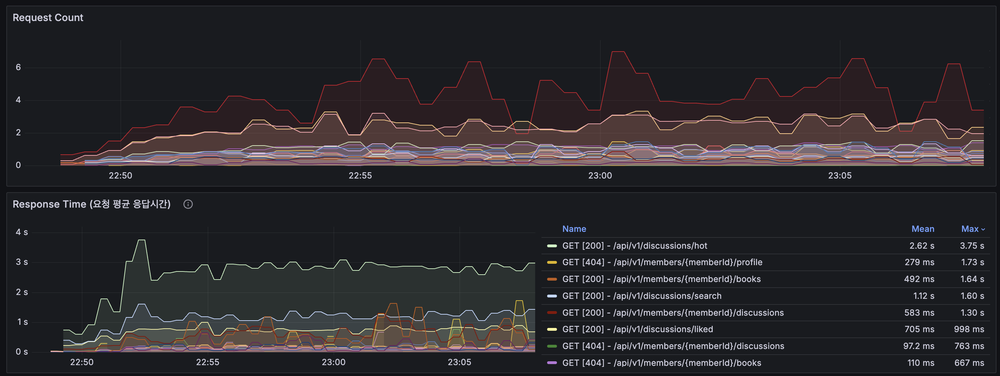
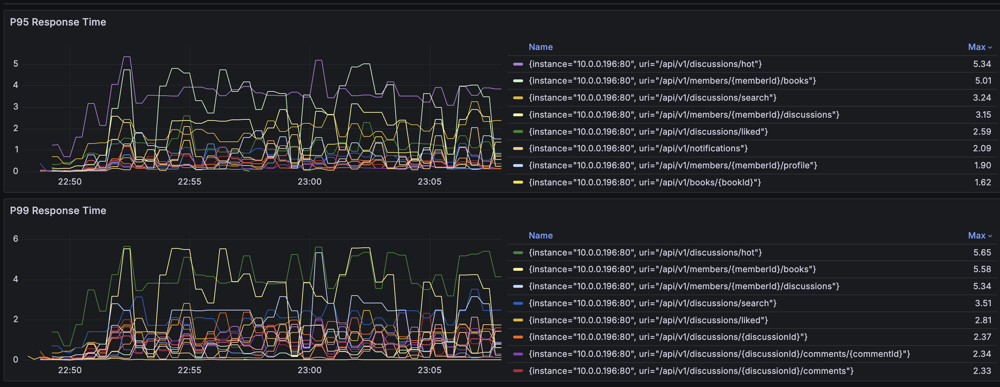

인기 토론방의 조회 쿼리 개수를 **7개 → 3개**로 단축하고 나니 앞선 요청 타임아웃, 즉 극심한 병목 현상이 **해결되었습니다**.

그러나 이는 오직 테스트 통과라는 최소 조건만 만족할 뿐, 완전한 성능 개선이라고 보기 어려웠습니다.

**문제**

1. 처리량이 매우 적었습니다. 평균적으로 **10~20rps**의 처리량을 수행합니다.
2. 응답 시간이 느리고, 여전히 인기 토론방 조회 로직은 최대 **5s**의 시간이 소요됩니다. (P95, P99 기준)
3. DB CPU 부하가 매우 큽니다 (**100**%)

## Refactor 2

---

**해결**

DB에 여전히 부하가 크기 때문에, 모든 토론방 조회 API의 공통 로직(getDiscussionResponses)을 (앞서 인기 토론방 조회 API에 적용했던) 쿼리 1개짜리로 수정했습니다.

따라서 모든 토론방 조회 API가 쿼리가 2개씩 감소한 것입니다.

## After Test 2 : 토론방 집계 공통 쿼리 축소 결과

---

- **테스트 (11/3 23:17:00 - 23:37:00)**

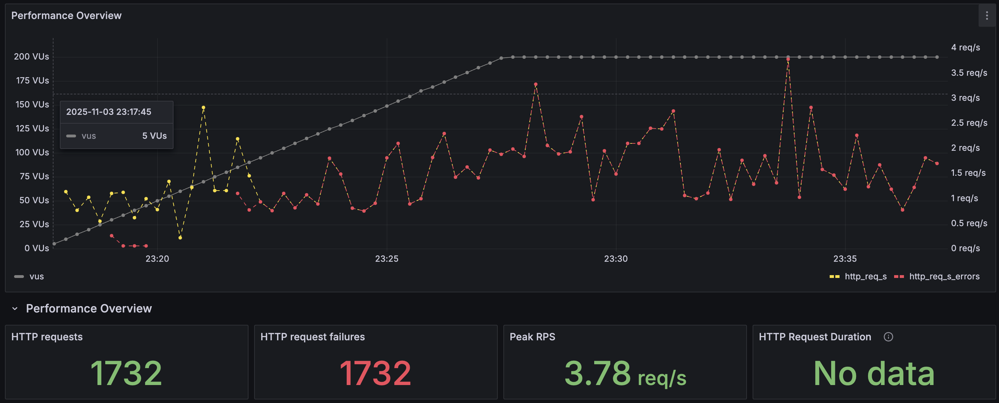
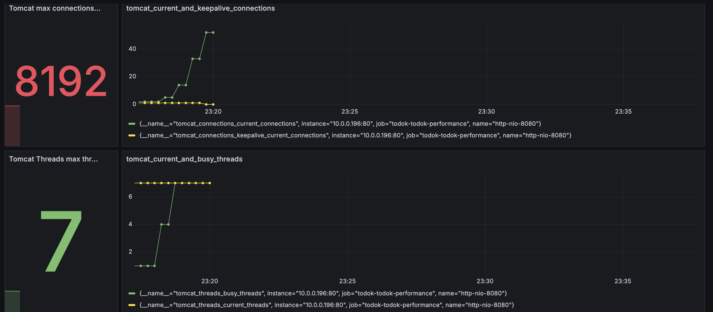
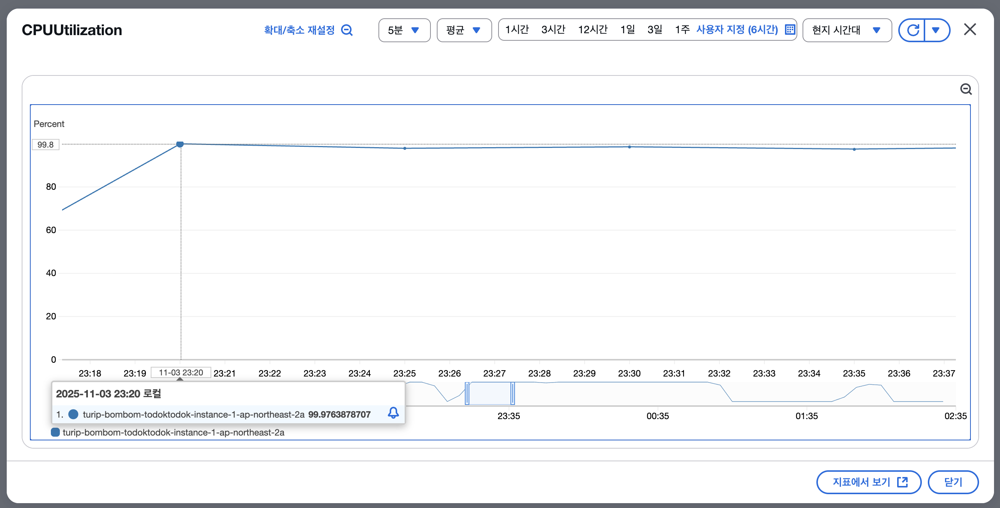

그러나 다시 테스트를 시작하자마자 After Test 1과 같은 결과가 나왔습니다.

처음에 RPS가 다소 들쭉날쭉하더니 50VUs부터 극심한 병목으로 모든 요청이 MySql 타임아웃 실패했습니다.

DB CPU 병목 또한 그대로였습니다 (99.8%)

**문제**

네트워크 왕복을 줄이기 위해 과도하게 쿼리를 합치니, **DB의 과부하 비용이 너무 커져버린 것**이라고 생각했습니다.

일전에 이렇게 물어봤는데요,

> 그렇다고 가벼운 쿼리 여러개를 보내는것보다, 무거운 쿼리 하나를 만들고 인덱싱 등으로 개선하는 게 **항상** 나을까요?
>

이번 테스트에서 그렇지 않다는 걸 깨달을 수 있었습니다.

## Refactor 3

---

**해결**

추측한 문제가 맞는지 확인하기 위해 `getDiscussionsResponses` 로직을 원복했습니다.

다시 해당 공통 로직의 쿼리가 1개 → 3개로 늘어났고, 모든 토론방 조회 로직의 쿼리는 **평균 3~5개** 사이를 유지했습니다.

```java
  private List<DiscussionResponse> getDiscussionsResponses(
          final List<Long> discussionIds,
          final Member member
  ) {
      if (discussionIds.isEmpty()) {
          return List.of();
      }

      final List<DiscussionLikeSummaryDto> likeSummaries = discussionLikeRepository.findLikeSummaryByDiscussionIds(
              member, discussionIds);
      final List<DiscussionCommentCountDto> commentCounts = commentRepository.findCommentCountsByDiscussionIds(
              discussionIds);

      final Map<Long, LikeCountAndIsLikedByMeDto> likesByDiscussionId = mapLikeSummariesByDiscussionId(likeSummaries);
      final Map<Long, Integer> commentsByDiscussionId = mapTotalCommentCountsByDiscussionId(commentCounts);

      return makeResponsesFrom(discussionIds, likesByDiscussionId, commentsByDiscussionId);
  }
  
	@Query("""
                SELECT new todoktodok.backend.discussion.application.service.query.DiscussionLikeSummaryDto(
                    d.id,
                    COUNT(dl),
                    CASE WHEN SUM(CASE WHEN dl.member = :member THEN 1 ELSE 0 END) > 0 
                         THEN true 
                         ELSE false END
                )
                FROM Discussion d
                LEFT JOIN DiscussionLike dl ON dl.discussion = d
                WHERE d.id IN :discussionIds
                GROUP BY d.id
        """)
	List<DiscussionLikeSummaryDto> findLikeSummaryByDiscussionIds(
        @Param("member") final Member member,
        @Param("discussionIds") final List<Long> discussionIds
  );
  
  @Query("""
              SELECT new todoktodok.backend.discussion.application.service.query.DiscussionCommentCountDto(
                  d.id,
                  COUNT(DISTINCT c.id),
                  COUNT(DISTINCT r.id)
              )
              FROM Discussion d
              LEFT JOIN Comment c ON c.discussion = d
              LEFT JOIN Reply r ON r.comment = c
              WHERE d.id IN :discussionIds
              GROUP BY d.id
          """)
  List<DiscussionCommentCountDto> findCommentCountsByDiscussionIds(@Param("discussionIds") final List<Long> discussionIds);
```

```java
 private List<DiscussionResponse> makeResponsesFrom(
          final List<Long> discussionIds,
          final Map<Long, LikeCountAndIsLikedByMeDto> likeSummaryByDiscussionId,
          final Map<Long, Integer> commentCountsByDiscussionId
  ) {
      final Map<Long, Discussion> discussions = discussionRepository.findDiscussionsInIds(discussionIds).stream()
              .collect(Collectors.toMap(Discussion::getId, discussion -> discussion));

      return discussionIds.stream()
              .map(discussionId -> {
                  final Discussion discussion = discussions.get(discussionId);
                  final int likeCount = likeSummaryByDiscussionId.get(discussionId).likeCount();
                  final int commentCount = commentCountsByDiscussionId.getOrDefault(discussionId, 0);
                  final boolean isLikedByMe = likeSummaryByDiscussionId.get(discussionId).isLikedByMe();
                  return new DiscussionResponse(discussion, likeCount, commentCount, isLikedByMe);
              })
              .toList();
  }
  
  @Query("""
                 SELECT d
                 FROM Discussion d
                 WHERE d.id IN :discussionIds
          """)
  List<Discussion> findDiscussionsInIds(@Param("discussionIds") final List<Long> discussionIds);
```

## After Test 3 : 토론방 집계 공통 쿼리 원복 결과

---

- **테스트 (11/4 01:49:00 - 02:09:00)**


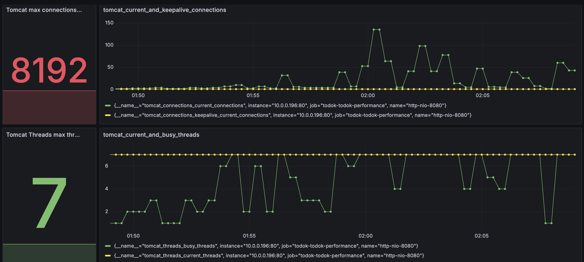
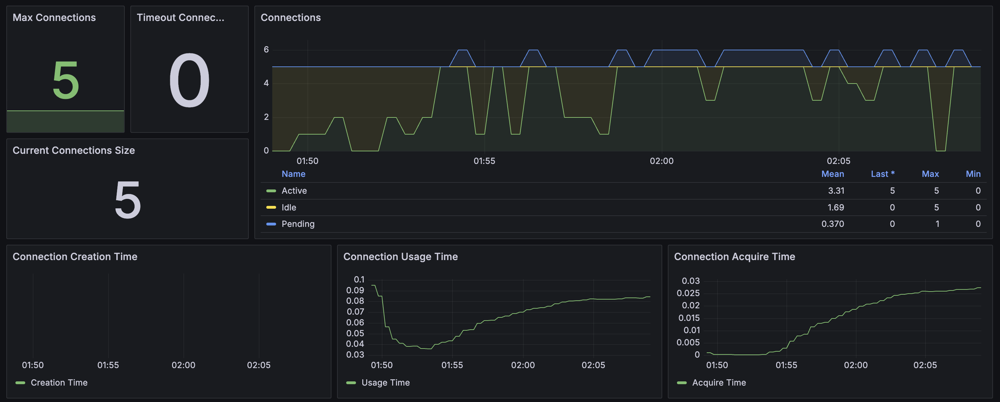


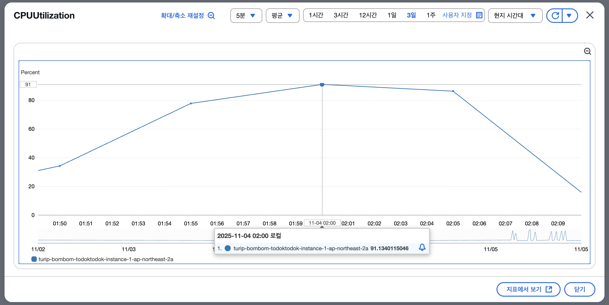

테스트 결과가 원복되었고, RPS 및 응답 시간이 개선되었습니다.

평균 RPS는 After Test1과 비교했을 때 평균 10~20rps → **20~40rps**로 개선되었습니다.

또한 가장 오래 걸렸던 인기토론방 조회 로직 (`/api/v1/discussions/hot`)이 응답 시간 기준 5위 정도를 차지하면서 해당 API는 확실히 개선이 되었음을 알 수 있습니다. 평균 응답 시간은 **최대 1s 이하**로 안정화되었습니다.

DB CPU도 최대 **91**%로, 여전히 높지만 부하가 줄어들었음을 알 수 있습니다.

**문제**

추가적인 병목이 발견되었습니다. 슬로우 쿼리를 보았을 때 회원별 참여 토론방 조회 쿼리, 회원별 활동 도서 조회 쿼리가 2초 이상으로 기록되었어요.

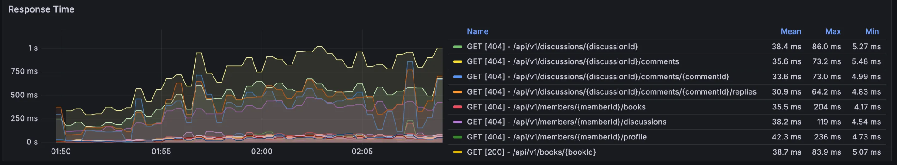
응답 시간은 1초 이하로 찍힌다.

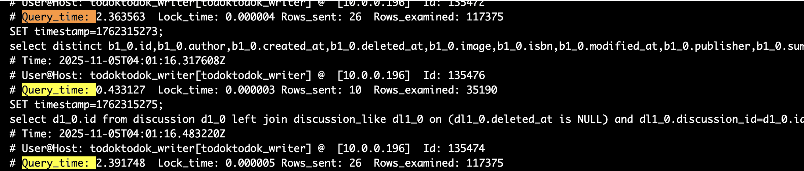
쿼리 실행 시간은 2.3초로 찍힌다 → ??

이상하지 않나요? 응답시간은 많아봐야 1s인데 쿼리 실행 시간이 2s 이상이라니! ~~타임워프?~~

이때, **P95, P99 응답시간**을 보았을 때 `/api/v1/members/{memberId}/discussions`, `/api/v1/members/{memberId}/books`, `/api/v1/discussions/search` 는 응답 시간이 2초 이상 소요된 것을 알 수 있어요.

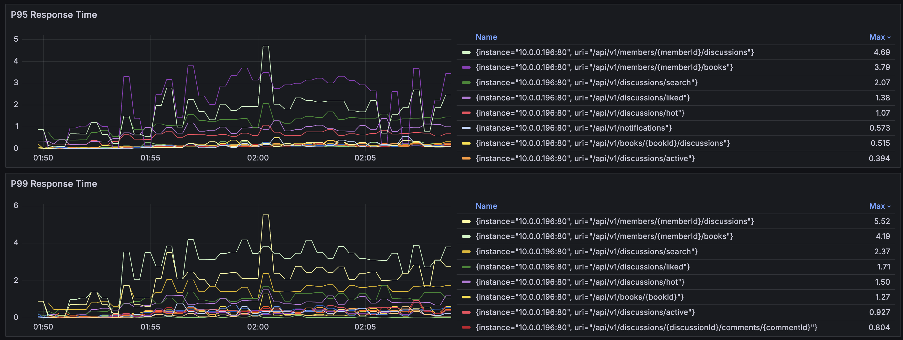

즉, 평균적으로는 응답시간이 안정화되었지만 이는 꼬리 지연 시간을 숨긴 통계라는 것을 알 수 있습니다.

## 주의 : 꼬리 지연 시간의 문제

---

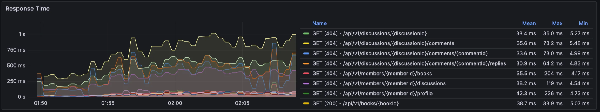

우리가 늘상 보는 이 Response Time 지표는… **뭘까요**?

저는 Mean, Max, Min이 항상 있길래 당연히 모든 응답 시간의 평균, 최대, 최소인 줄 알았습니다.

```jsx
irate(http_server_requests_seconds_sum{
	job="$job", 
	instance="$instance", 
	application="$application", 
	exception="none", 
	uri!~".*(prometheus|health).*", 
	namespace="$Namespace"}[$__rate_interval]) 
/ 
irate(http_server_requests_seconds_count{
	job="$job", 
	instance="$instance", 
	application="$application", 
	exception="none",
	uri!~".*(prometheus|health).*", 
	namespace="$Namespace"}[$__rate_interval])
```

이게 해당 지표의 PromQL인데요, 놀랍게도 각 구간의 **평균 응답시간의 평균, 최대, 최소**라고 합니다. ~~평균의 평균~~

이는 양극단에 있는 값을 보정하기 때문에 진짜 최대 응답시간이 몇인지는 알 수 없어요. 즉, 꼬리 지연 시간을 숨겨버린다는 문제가 있습니다.

이를 해결하기 위해서는 **P95, P99 지표**를 추가할 수 있어요.

```jsx
histogram_quantile(0.99,
sum(rate(http_server_requests_seconds_bucket{
	job="todok-todok-performance",
	instance="10.0.0.196:80",
	application="",
	exception="none",
	uri!~".*(prometheus|health).*",
	namespace=""}[$__rate_interval])
) by (le, uri, instance))
```

그러는 순간 1s 아래인 줄 알았던 응답시간이 이렇게 **껑충** 튀어요. 레전드죠 ㅋㅋ


**💎 What I learned**

그라파나 지표를 잘 해석합시다! 자주 쓰는 메트릭은 꼭 PromQL을 지피티에게 물어가며 학습하고, 내가 원하는 값을 왜곡 없이 보여주는지 꼼꼼한 검증이 필요한 것 같아요.

## Refactor 4

---

**해결**

지금까지 가장 큰 병목을 유발했던 API인 인기 토론방 조회 API를 개선했습니다.

이제는 지금처럼 다른 API들의 성능도 개선을 해야 했는데요, **가장 중요한 첫 개선은 토론방 조회 공통 로직에서의 성능 개선**이라고 생각했습니다. 모든 핵심 API가 사용하는 쿼리니까요.

이전 테스트에서 모아뒀던 슬로우 쿼리(0.9초 이상 소요) 목록에서 토론방 집계 로직에서 사용하는 쿼리를 개선 대상으로 골랐습니다. 이는 **댓글 + 대댓글 수를 집계하는 쿼리**였습니다.

이번엔 하나의 쿼리를 개선하는 것이기 때문에, **실행 계획을 보고 인덱스를 추가**할 계획을 잡았습니다.

슬로우 쿼리에 찍힌 쿼리를 그대로 복사하면 아래와 같았습니다.

```sql
use todoktodok;
explain select d1_0.id,count(distinct c1_0.id),count(distinct r1_0.id) from discussion d1_0 left join comment c1_0 on (c1_0.deleted_at is NULL) and c1_0.discussion_id=d1_0.id left join reply r1_0 on (r1_0.deleted_at is NULL) and r1_0.comment_id=c1_0.id where (d1_0.deleted_at is NULL) and d1_0.id in 
(4,5,9,10,11,12,16,1261,1262,1263,1264,1265,1266,1267,1268,1269,1270,1271,1272,1273,1274,...,6970,6971,6972,6973,6974,6975,6976,6977,6978,6979,6980,6981,6982,6983,6984,6985,6986,6987,6988,6989,6,7,3,2,8,14,15,1,13)
group by d1_0.id;
```

`EXPLAIN`으로 실행 계획을 조사하면 아래와 같았어요. **인덱스 테이블을 풀스캔**하는 것을 볼 수 있습니다.


왜일까요? 토론방 ID 리스트를 넘기면 각각의 토론방에 대해 집계를 하는 배치 쿼리인데, Mysql 옵티마이저가 해당 토론방 ID 리스트의 크기가 커지니 토론방 ID 인덱스 테이블을 풀스캔하는 것이 낫다고 선택했기 때문입니다.

문제의 핵심 원인은 **팬아웃(Fan-out) 조인**입니다.

`discussion` -> `comment` -> `reply`로 이어지는 1:N 조인이 연쇄적으로 발생하여, 집계 이전에 **엄청난 수의 중간 결과 행**을 만들어낸다는 점입니다.

`EXPLAIN ANALYZE` 결과를 보면 명확합니다.

- **EXPLAIN ANALYZE 결과**

    ```sql
    -> Group aggregate: count(distinct c1_0.id), count(distinct r1_0.id)  (cost=164e+6 rows=5241) (actual time=31.1..335 rows=5745 loops=1)
        -> Nested loop left join  (cost=120e+6 rows=436e+6) (actual time=1.7..303 rows=49111 loops=1)
            -> Nested loop left join  (cost=126958 rows=631246) (actual time=0.74..114 rows=27305 loops=1)
                -> Filter: ((d1_0.deleted_at is null) and (d1_0.id in (4,5,9,10,11,12,16,1261,1262,1263,1264,1265,1266,1267,1268,1269,1270,1271,1272,1273,1274,1275,1276,1277,1278,1279,...,6919,6920,6921,6922,6923,6924,6925,6926,6927,6928,6929,6930,6931,6932,6933,6934,6935,6936,6937,6938,6939,6940,6941,6942,6943,6944,6945,6946,6947,6948,6949,6950,6951,6952,6953,6954,6955,6956,6957,6958,6959,6960,6961,6962,6963,6964,6965,6966,6967,6968,6969,6970,6971,6972,6973,6974,6975,6976,6977,6978,6979,6980,6981,6982,6983,6984,6985,6986,6987,6988,6989,6,7,3,2,8,14,15,1,13)))  (cost=548 rows=524) (actual time=0.34..4.5 rows=5745 loops=1)
                    -> Index scan on d1_0 using PRIMARY  (cost=548 rows=5241) (actual time=0.334..3.14 rows=5745 loops=1)
                -> Filter: (c1_0.deleted_at is null)  (cost=121 rows=1204) (actual time=0.00333..0.0185 rows=3.76 loops=5745)
                    -> Index lookup on c1_0 using discussion_created_idx (discussion_id=d1_0.id)  (cost=121 rows=1204) (actual time=0.00322..0.018 rows=3.76 loops=5745)
            -> Filter: (r1_0.deleted_at is null)  (cost=121 rows=691) (actual time=0.00345..0.00662 rows=0.8 loops=27305)
                -> Index lookup on r1_0 using comment_id (comment_id=c1_0.id)  (cost=121 rows=691) (actual time=0.00328..0.00636 rows=0.8 loops=27305)
    ```


이를 해석해보면 아래와 같은 과정을 거쳐요.

1. `discussion` 테이블에서 5,745건의 행을 찾았습니다. (빠름)
2. `comment` 테이블과 조인하여 27,305건의 행이 되었습니다. (1:N 조인)
3. `reply` 테이블과 다시 조인하여 **49,111건**의 행이 되었습니다. (또 1:N 조인)
4. 마지막으로 49,111건의 행을 `GROUP BY` 하면서 `COUNT(DISTINCT ...)`를 실행합니다.

즉, 서로 다른 두 개의 1:N 관계(discussion:comment, discussion:reply)를 한 쿼리에서 동시에 처리하려다 중간 데이터가 폭증(fan-out)했고, 이로 인해 `COUNT(DISTINCT)` 연산이 매우 비효율적으로 수행되고 있습니다.

이에 대해 재미니와 얘기하며 학습한 **해결방식**은 3가지 정도가 있습니다.

> 이부분에 대한 학습과 의사결정 과정은 아직 좀 부족한 것 같아요. 그냥 가볍게 읽어보고 넘어가면 좋을듯 합니다.
>
1. **사전 집계** : DISTINCT가 들어간 집계를 LEFT JOIN 위에서 바로 계산하면 정렬/중복 제거 비용이 큽니다. 보통은 “미리 합쳐서(사전 집계) 가져오기”가 훨씬 가볍습니다

   → 이는 실행계획 상 비효율적이므로 사용하지 않았습니다. 한 부모 당 수천~수만 자식이 있어서 진짜 ‘폭증’이 일어날 때 유리한 방식이기 때문입니다.

    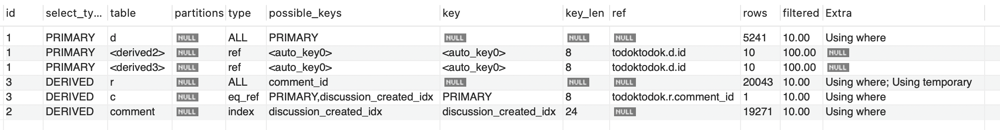
2. IN (discussion_ids) 리스트로 인해 불가피하게 discussion_id 인덱스를 풀스캔(index)하는 문제이므로 해당 테이블을 **임시테이블**로 만들어 사용합니다.

   임시테이블을 만들어 discussion_ids 리스트를 테이블화한 뒤 이를 기준으로 조인하면, 해당 임시테이블을 풀스캔하더라도 스캔하는 양이 많지 않아서 실질적인 풀스캔 비용이 적습니다.

    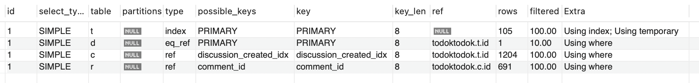
   → 임시테이블을 만드는 작업은 Jpa에서 불가능하기 때문에 후순위로 두었습니다. native query로 작성하면 DTO 프로젝션을 병행하기 어렵기 때문이에요.

3. **스칼라 서브쿼리**를 적용합니다.
    - 일단 JPQL에서의 코드는 이러해요.

        ```java
        /*
        jpql로 dto 프로젝션을 할 수 없음 -> 오류남
         */
        @Query(value = """
                SELECT
                    d.id AS id,
                    IFNULL(c.comment_count, 0) AS commentCount,
                    IFNULL(r.reply_count, 0) AS replyCount
                    
                FROM
                    discussion d
                    
                LEFT JOIN (
                    SELECT
                        discussion_id,
                        COUNT(id) AS comment_count
                    FROM comment
                    WHERE deleted_at IS NULL
                    GROUP BY discussion_id
                ) AS c ON d.id = c.discussion_id
                
                LEFT JOIN (
                    SELECT
                        c_inner.discussion_id,
                        COUNT(DISTINCT r_inner.id) AS reply_count
                    FROM reply r_inner
                    JOIN comment c_inner ON r_inner.comment_id = c_inner.id
                    WHERE r_inner.deleted_at IS NULL
                      AND c_inner.deleted_at IS NULL
                    GROUP BY c_inner.discussion_id
                ) AS r ON d.id = r.discussion_id
                
                WHERE
                    d.deleted_at IS NULL
                AND
                    d.id IN (:discussionIds)
             """, nativeQuery = true)
        List<DiscussionCommentCountDto> findCommentCountsByDiscussionIds2(@Param("discussionIds") List<Long> discussionIds);
        
        ```


    → 이 자체는 성능이 매우 안좋았습니다. 대신 이를 인덱스 적용으로 해결해보았습니다.
    
    ```sql
    CREATE INDEX idx_discussion_deleted_at_id ON discussion (deleted_at, id);
    CREATE INDEX idx_comment_discussion_id_deleted_at ON comment (discussion_id, deleted_at);
    CREATE INDEX idx_reply_comment_id_deleted_at ON reply (comment_id, deleted_at);
    ```
    
    실행계획 상으로는 큰 개선이 되었습니다. 테이블/인덱스 스캔을 하던 3가지 조인문에서 모두 커버링 인덱스를 사용하면서 시간도 크게 단축하였습니다.
    
    - **EXPLAIN ANALYZE 결과**
        
        ```sql
        -> Nested loop left join  (cost=15852 rows=0) (actual time=43.5..**52.5** rows=5745 loops=1)
        
            -> Nested loop left join  (cost=2702 rows=8386) (actual time=8.74..14.7 rows=5745 loops=1)
        
                -> Filter: ((d.deleted_at is null) and (d.id in (4,5,9,10,11,12,16,1261,1262,1263,1264,1265,1266,1267,1268,1269,1270,1271,1272,1273,1274,1275,1276,1277,1278,1279,1280,1281,...,6973,6974,6975,6976,6977,6978,6979,6980,6981,6982,6983,6984,6985,6986,6987,6988,6989,6,7,3,2,8,14,15,1,13)))  (cost=548 rows=524) (actual time=0.0897..2.73 rows=5745 loops=1)
        
                    -> Covering index scan on d using idx_discussion_deleted_at_id  (cost=548 rows=5241) (actual time=0.0863..1.73 rows=5745 loops=1)
        
                -> Index lookup on c using <auto_key0> (discussion_id=d.id)  (cost=2162..2164 rows=10) (actual time=0.00195..0.00195 rows=0.00279 loops=5745)
        
                    -> Materialize  (cost=2162..2162 rows=16) (actual time=8.64..8.64 rows=16 loops=1)
        
                        -> Group aggregate: count(`comment`.id)  (cost=2160 rows=16) (actual time=0.733..8.61 rows=16 loops=1)
        
                            -> Filter: (`comment`.deleted_at is null)  (cost=1967 rows=1927) (actual time=0.298..7.46 rows=21576 loops=1)
        
                                -> Covering index scan on comment using idx_comment_discussion_id_deleted_at  (cost=1967 rows=19271) (actual time=0.298..6.21 rows=21576 loops=1)
        
            -> Index lookup on r using <auto_key0> (discussion_id=d.id)  (cost=0.25..2.5 rows=10) (actual time=0.00642..0.00642 rows=0.00139 loops=5745)
        
                -> Materialize  (cost=0..0 rows=0) (actual time=34.8..34.8 rows=8 loops=1)
        
                    -> Group aggregate: count(distinct reply.id)  (actual time=29.3..34.8 rows=8 loops=1)
        
                        -> Sort: c_inner.discussion_id  (actual time=28.8..29.8 rows=21835 loops=1)
        
                            -> Stream results  (cost=2746 rows=200) (actual time=0.339..23 rows=21835 loops=1)
        
                                -> Nested loop inner join  (cost=2746 rows=200) (actual time=0.337..20 rows=21835 loops=1)
        
                                    -> Filter: (r_inner.deleted_at is null)  (cost=2045 rows=2004) (actual time=0.324..9.28 rows=21835 loops=1)
        
                                        -> Covering index scan on r_inner using idx_reply_comment_id_deleted_at  (cost=2045 rows=20043) (actual time=0.323..7.77 rows=21835 loops=1)
        
                                    -> Filter: (c_inner.deleted_at is null)  (cost=0.25 rows=0.1) (actual time=250e-6..334e-6 rows=1 loops=21835)
        
                                        -> Single-row index lookup on c_inner using PRIMARY (id=r_inner.comment_id)  (cost=0.25 rows=1) (actual time=125e-6..151e-6 rows=1 loops=21835)
        ```
        
    
→ 그러나 스칼라 서브쿼리 또한 Jpa에서는 불가능한 작업입니다. 
    
그래서 저는 스칼라 서브쿼리는 쓰지 않고, 인덱싱만 유지했습니다. 실행계획 상으로는 인덱스가 성능 개선의 핵심이기 때문이었어요.

말이 길었지만 이는 다 과정이었고, 결국은 인덱싱만 추가했습니다.

인덱스를 많이 추가했고 카디널리티가 우려되었으나 일단 후속적인 문제는 따로 해결하기로 하고, 현재 쿼리 개선해 집중해서 이러한 해결책을 내렸어요.

## After Test 4 : 인덱스 추가 결과

---

- **테스트 (11/4 22:28:00 - 22:48:00)**


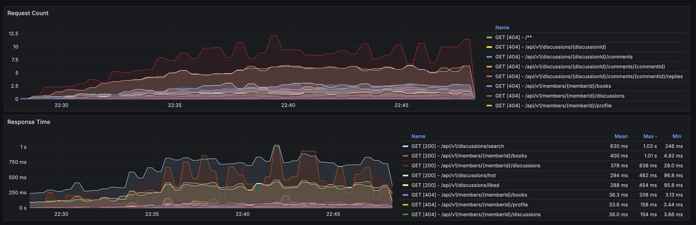


결과는 **생각보다 크게 차이나지 않았습니다**.

평균 20-40rps인 점도 유사하고, 평균 응답 시간은 1s 이하지만 P95 시간은 4~5s로 개선이 크게 되지 않은 점도 유사했어요.

- **테스트 (11/4 11:06:00 - 11:26:00)**

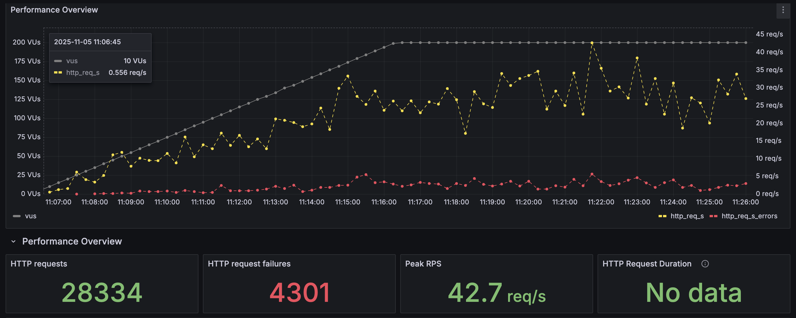
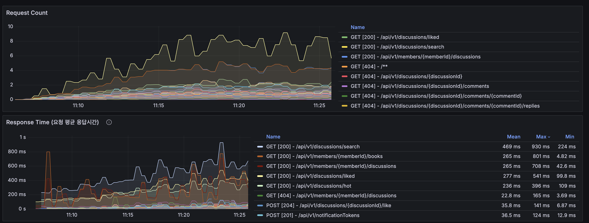
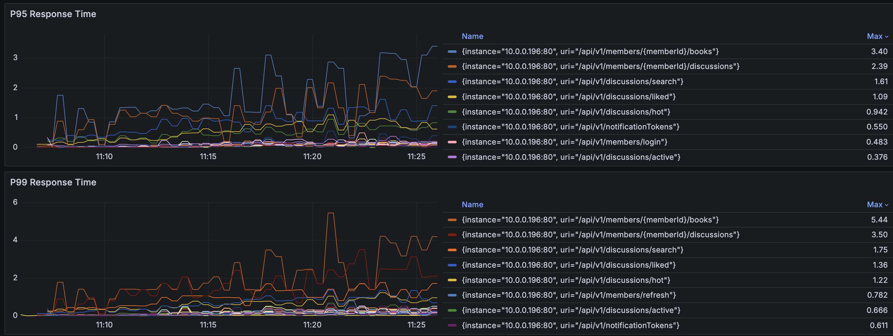

인덱스 추가 전후를 빠르게 비교해보기 위해, 테스트 스크립트에서 주석처리했던 POST 요청도 넣어서 테스트해봤어요.

평균 15-35rps에 응답 시간은 유사해서, POST로 인해 약간의 지연은 생겼지만 **거의 차이 없다**고 생각했습니다.

**문제**

그 이유가 무엇일까요? 공통 로직의 쿼리도 조금 개선했는데, 큰 개선이 없네요.

찾아본 결과 저는 그 이유를 여전히 가장 많이 발생하는 슬로우쿼리에서 찾았습니다.

`/api/v1/members/{memberId}/discussions`, `/api/v1/members/{memberId}/books` 가 쿼리 실행 시간도, 지연 시간도 유독 길게 나오는 것이 이상해서 해당 쿼리와 DB 테이블을 관찰했고, **모든 데이터의 member_id가 1**이라는 것을 알게 되었어요.

**🧐 왜 모든 member_id가 1이지?**

현재 쌓인 10만 건의 데이터는 그동안 부하테스트에서 POST를 반복하면서 자연스럽게 축적된 데이터입니다.

그리고 저희는 테스트 극초반에 테스트를 위해 애플리케이션 코드를 수정할 때, 사전 인증 과정 때문에 비즈니스 로직을 찌를 수 없다는 문제가 있었어요. (다 401로 막힘) 이를 해결하려면 인증 과정을 주석처리하고, 대신 반환해야 하는 memberId를 1L이라는 고정값으로 반환했죠. 이는 **즉 매번 member_id = 1로 로그인을 해서 POST를 처리**했다는 거예요.

이는 단순히 테스트를 통과하게 하기 위한 시도였지만, 덕분에 10만건의 데이터의 대부분의 생성자가 memberId = 1이 되면서, 현재 테이블에 있는 모든 데이터는 member_id = 1인 회원이 작성한 것으로 되었어요.

이게 정상적인 상황일까요? 아니요. /members로 시작하는 로직들은 모두 병목이 생기게 되었어요.

memberId = 1인 회원의 참여한 토론방이나 활성 도서를 조회하면 토론방 5000건, 댓글 20000건, 대댓글 20000건이 모두 조회되었으니까요. 사실상 페이징도 없이 테이블 풀스캔을 한 격이 되었습니다.

**💎 What I learned**

저는 테스트를 사소한 부분까지도 현실적인 시나리오를 재연한다는 목표를 가져야만 테스트에 불량한 결과가 나오지 않는다는 걸 배웠어요. 또, 테스트 데이터도 핵심 테이블에만 대충 넣을 게 아니라 전반적인 테이블에 고르게 넣어야 해요. 쿼리에서 호출하는 순간, 비현실적인 테이블은 비현실적인 결과를 불러일으키니까요.

## Refactor 5

---

**해결**

member와 관련된 테스트 환경을 현실과 가깝게 대폭 수정했습니다.

개선한 환경은 아래와 같이 4가지였어요.

1. 멤버 수가 8명이고, 이는 멤버 기준 조회 시 필요한 부하를 만들지 않는다.

   → 해결 : 멤버 데이터를 목표 MAU인 3000명으로 추가

    ```sql
    INSERT INTO member (created_at, modified_at, deleted_at, email, nickname, profile_image, profile_message)
    SELECT
        NOW(6),                                     -- created_at
        NOW(6),                                     -- modified_at
        NULL,                                       -- deleted_at
        CONCAT('user', seq, '@example.com'),        -- email (unique)
        CONCAT('nickname_', seq),                   -- nickname (unique)
        CONCAT('https://example.com/profile/', seq, '.png'),
        CONCAT('Hello, I am user_', seq)
    FROM (
        SELECT @row := @row + 1 AS seq
        FROM information_schema.columns AS c1
        CROSS JOIN information_schema.columns AS c2
        CROSS JOIN (SELECT @row := 0) AS r
        LIMIT 3000
    ) AS t;
    ```

   이때, 기존 데이터가 있다면 충돌하지 않도록 유의해야 해요.

2. 기존에 데이터베이스에 있던 discussion, comment, reply, discussion_like, comment_like, reply_like, notification_token, discussion_member_view 테이블의 데이터의 모든 작성자가 member_id = 1이었습니다.

   → 해결 : member_id를 1~3000 사이에서 골고루 섞이도록 UPDATE 합니다.

   이때, 상위 n%의 열성유저부터 활동하지 않는 유저를 모두 고려하는 것이 현실에 더 가깝고, 진짜 일어날 법한 부하만 만들 수 있어요.

   저는 아래와 같은 **가중치를 두고** member_id를 분배했습니다.

    ```java
    10~30L : 20% 확률 // 열성 유저 20명 - member_id에 20%의 확률로 10~30L 중 하나의 값을 배정한다. (한 명당 약 50개의 토론방 개설)
    30~1500L : 60% 확률
    1500~2500L : 20% 확률
    2500~3010L : 0% 확률
    ```
   10L부터 시작하는 이유는, member_id 중 8L인 데이터가 없어서 입니다. 요청 오류를 방지하기 위해 여유 있게 1~9L의 member_id는 사용하지 않았습니다.

    ```sql
    //개발 환경에서는 아예 해제해줘도 좋지만, 안정을 위해선 잠시 해제해두고 UPDATE 가 종료되면 다시 활성화해요.
    SET SQL_SAFE_UPDATES = 0;
    SET FOREIGN_KEY_CHECKS = 0;
    
    //member_id가 있는 테이블이라면 테이블명만 바꾸면 바로 변경사항을 적용할 수 있어요.
    UPDATE todoktodok.discussion
    SET member_id = (
      CASE
        WHEN RAND() < 0.2 THEN FLOOR(10 + (RAND() * 21))               -- 10~30 (20%)
        WHEN RAND() < 0.8 THEN FLOOR(30 + (RAND() * 1471))             -- 30~1500 (60%)
        ELSE FLOOR(1500 + (RAND() * 1001))                             -- 1500~2500 (20%)
      END
    );
    ```

3. 로그인 시 항상 member_id = 1로 로그인시켜서, POST 시에 매번 member_id = 1로만 생성되었습니다.

   → 해결 : ArgumentResolver에서 자주 활성화하는 유저 범주인 1~1500L 사이에서 랜덤한 id를 골라 로그인시킵니다.

   이때 멀티스레드임을 감안해 `Random` 모듈보다는 `ThreadLocalRandom`를 활용하면 좋아요.

    ```java
      return ThreadLocalRandom.current().nextLong(10L, 1500L);
    ```

4. k6 스크립트에서 memberId가 파라미터로 필요한 요청에서도, memberId는 10~2000L 사이에서 랜덤하게 골랐습니다.

## After Test 5 : 멤버 데이터 분포 균일화 결과

---

- **테스트 (11/5 13:42:00 - 14:02:00)**


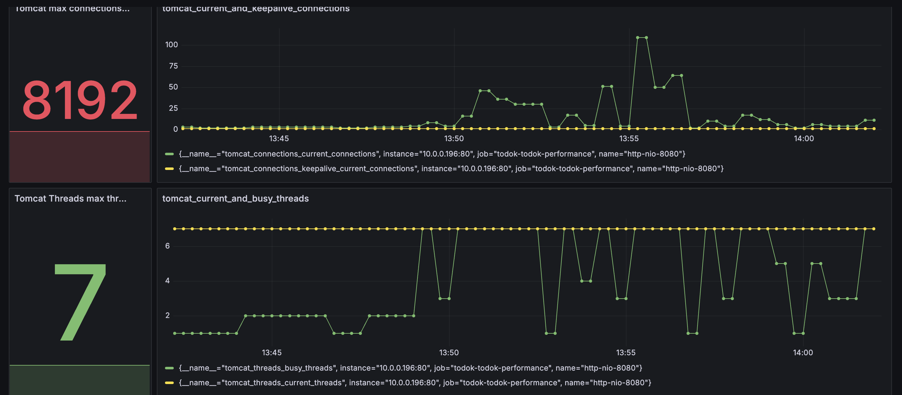
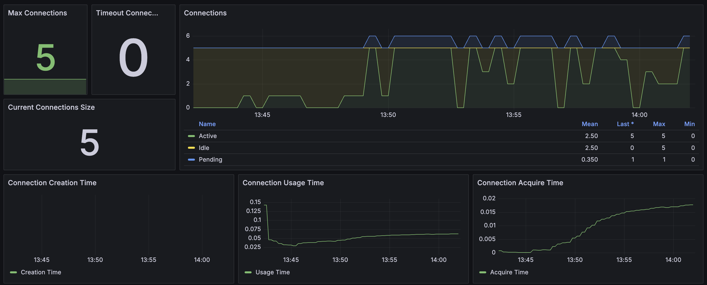
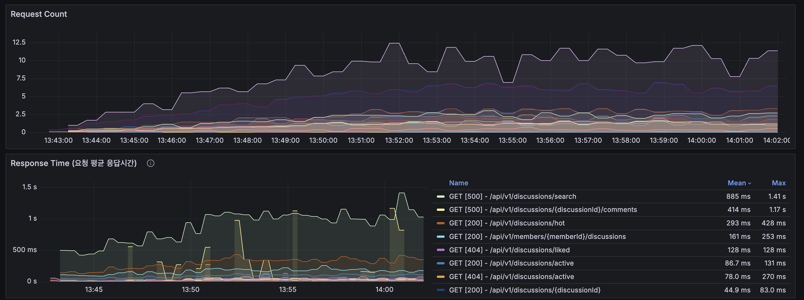

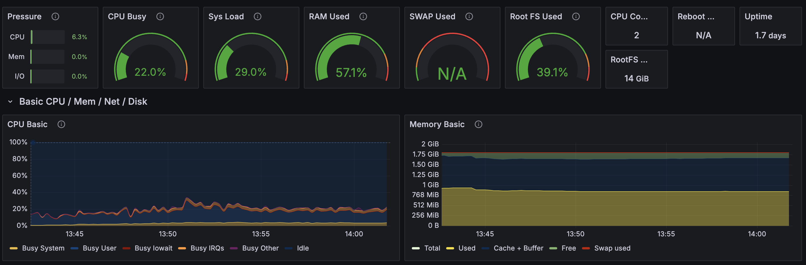
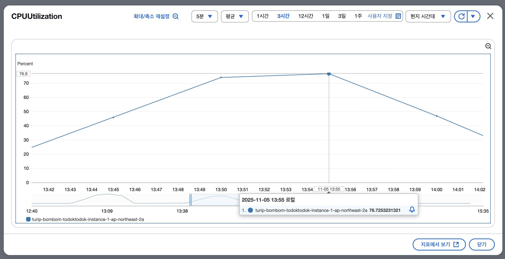

드디어 좀 만족스러운 결과가 나왔어요!

테스트 데이터가 상당히 현실과 가까워지자 회원별 토론방과 회원별 도서 api의 소요 시간이 확 줄었습니다 : **P99** 기준 최대 3.16초(도서), 5.25초(토론방) → `1.27`초(도서), `0.673`초(토론방)으로 각각 **2초, 5초 줄었어요**.

여러개가 반복적으로 나오고 1~2초 이상까지 다양하게 찍혔던 슬로우쿼리는, 이번 테스트에서는 오직 2개만 찍혔습니다. 각각 `1.022727`초, `1.235011`초였어요.

DB 부하가 확실히 줄었는지, DB CPU 사용률도 **76.9%** 로 안정화되었어요.

**💎 What I learned**

데이터의 이상을 눈치채지 못하고 냅다 인덱스나 쿼리 개선을 적용하면 어땠을까요? 도움은 됐겠지만, 무리한 인덱스 적용 등으로 오히려 역효과가 날 수도 있었을 겁니다.

부하테스트는 특히 임의로 만든 가상의 상황에서 진행하기 때문에 생각지도 못한 부분에서 문제의 원인을 찾을 수 있는 것 같아요. 이를 잘 유의하고, 병목이 생기면 원인을 꼭 꼼꼼히 따져봐야 할 것 같습니다.

**문제**

그렇지만 근본적으로 **RPS는 3연속 여전히 개선이 되지 않습니다. 😱** After Test 3 이후로 쭉 평균 20~40RPS에 머물러있었어요.

또한, 여전히 눈에 띄는 병목이 딱 하나 있습니다 : **토론방 && 도서 검색** (`/api/v1/discussions/search`) 이건 아직 최대 3초가 걸려요. 그치만 나머지는 다 최대 1초대라서 만족합니다. (?)

## Refactor 6

---

**해결**

물론 아직 개선해야 할 사항이 많이 있지만, 아무리 개선해도 RPS는 잘 개선되지 않는 현 상황은 **톰캣 스레드풀과 HikariCP 커넥션풀을 다시 튜닝해볼 신호라고 해석**했습니다.

현재의 개수(스레드풀 7개, 커넥션풀 5개)는 DB 병목이 극심할 때 그나마 테스트가 어떻게라도 돌아가게 하기 위해서 설정한 최적의 값입니다.

따라서 매우 작은 풀사이즈이므로 그만큼 처리량에는 한계가 있어요.

처리량을 개선했으니 이제 풀 사이즈를 더 늘려도, 즉 동시에 처리할 수 있는 양을 늘려도 괜찮지 않을까? 하는 생각으로 스레드풀 사이즈를 10, 커넥션풀 사이즈를 10으로 올렸습니다.

## After Test 6

---

결과는, **아직 올리면 안되는 상태입니다. 🔨** 아오

- **테스트 (11/5 17:08-17:28) - Tomcat 10, HikariCP 10**

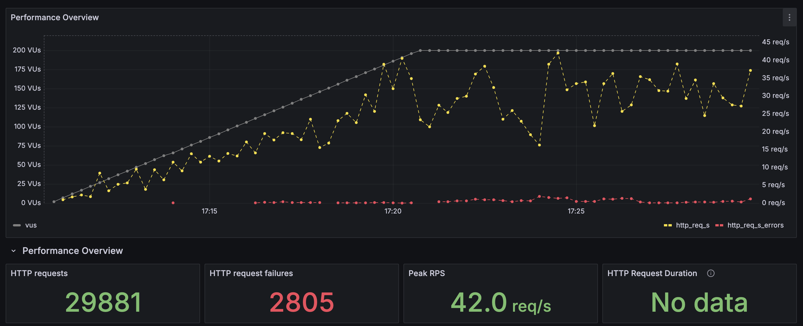
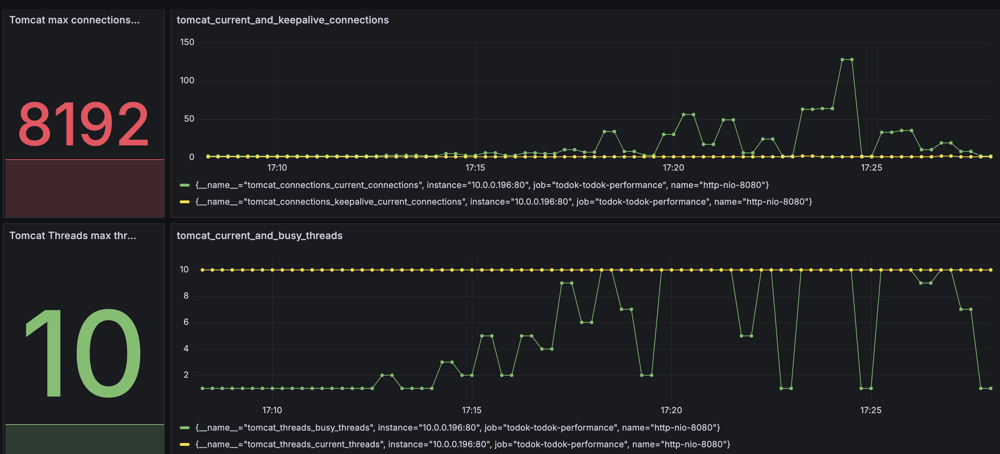
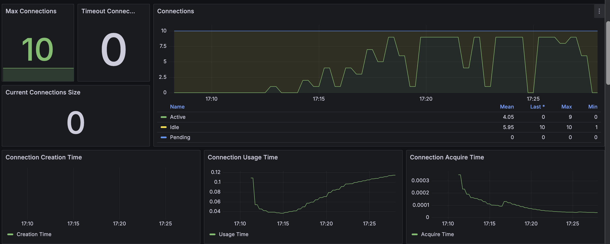

- **테스트 (11/5 17:40 - 18:00) - Tomcat 10, HikariCP 7**

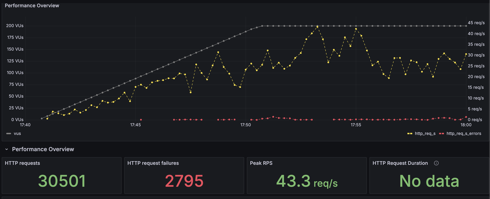
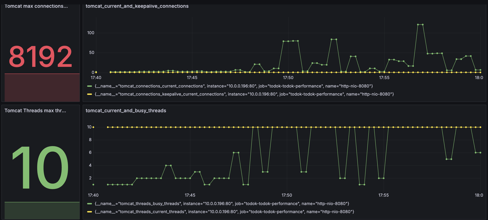
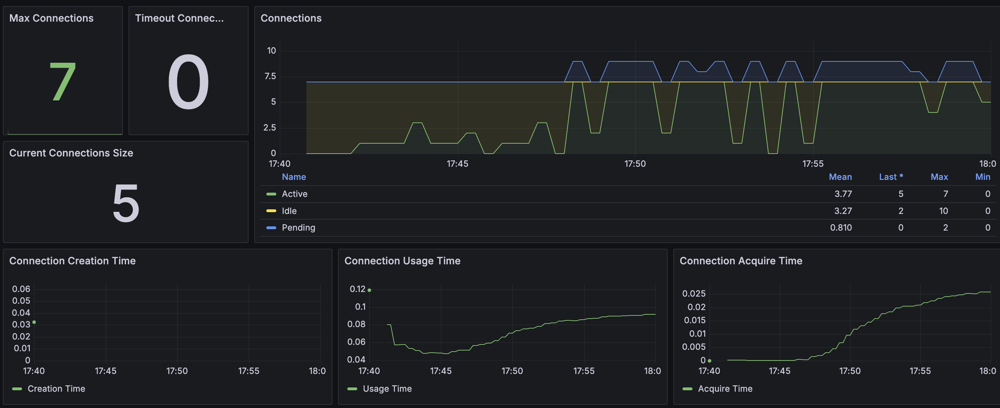

- **테스트 (11/5 20:40 - 21:00) - Tomcat 8. HikariCP 6**

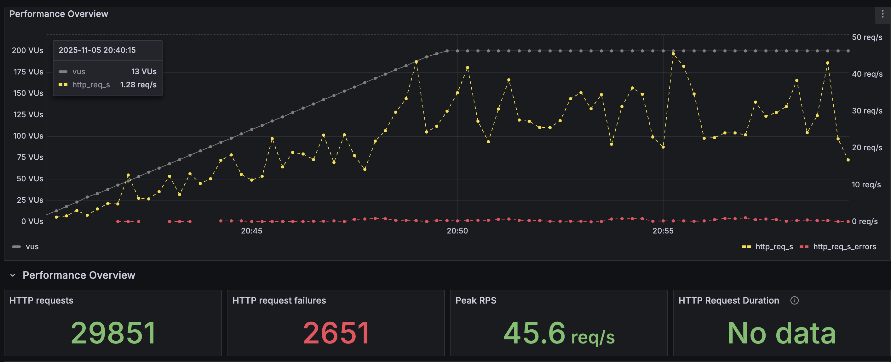
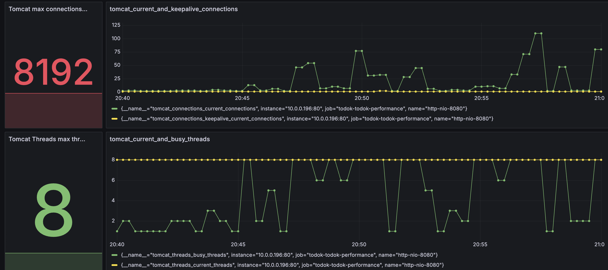
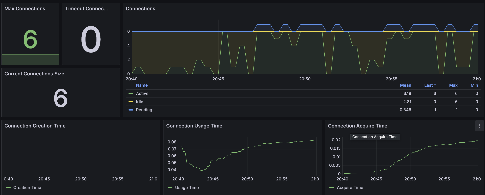

신기한건지, 이게 맞는 건진 모르겠지만 HikariCP connnection Pool 사이즈가 줄어들수록 RPS와 응답 시간이 조금씩 개선되었어요!

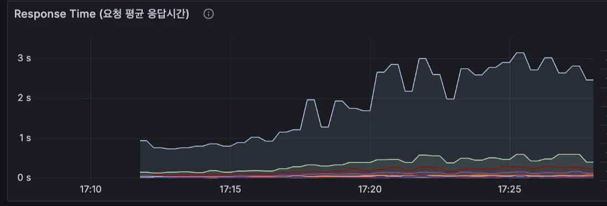
~3s

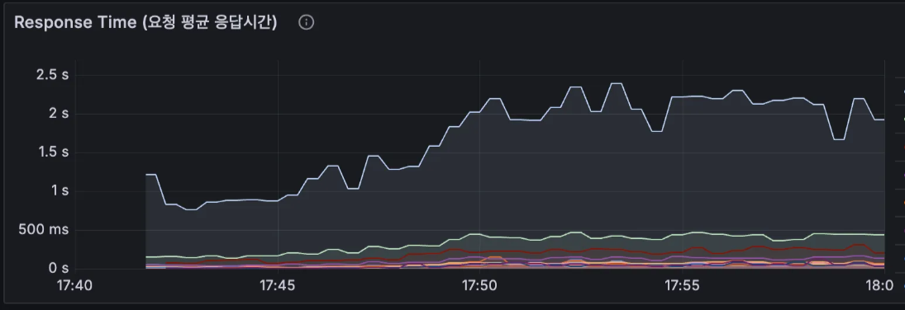
~2.5s

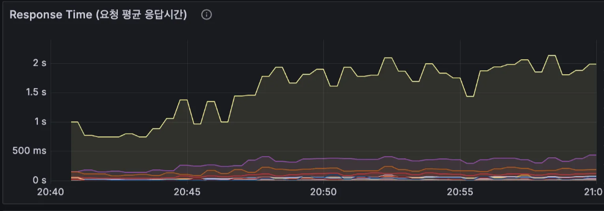
~2s

그리고 딱 맞게 기존의 After test 5 (Tomcat 7, HikariCP 5)의 결과가 이 세 테스트보다 좋아요 ㅋㅋ

이렇게나 개선했는데 아직도 HikariCP 는 5개밖에 안된다니… 조금 놀랍지만 **현재 상태에서 데이터베이스의 동시 처리량은 5가 최적**이라는 걸 알 수 있겠네요!

## 🚨 RPS에 집착하지 말자.

---

AfterTest 6을 하면서 또다시 `우리 서버가 얼마나 버티는가?` 에 빠지게 되더라구요.

그러나 RPS는 우리 서버의 능력치를 모두 대변하지 않으며, 앞에서 말했듯 이는 테스트의 스크립트에 따라서도 다르다는 걸 기억해야 해요.

성능이 엉망으로 나오더라도 냅다 600VUs까지 올리면 RPS가 훅 올라가거든요.. ㅋㅋ

하다못해 테스트 시 Think time(현재는 10초)를 줄이기만 해도 TPS는 올라갑니다.

다시, **중요한건 이 테스트 결과가 신뢰 가능한지, 그리고 초반에 계획했던 목표 TPS를 버틴다고 보장할 수 있는지!** 입니다.

## 결론

---

**이번 부하테스트에서 변경한 사항입니다.**

1. 인기 토론방 조회의 쿼리 개수 7 → 5개로 단축
2. 모든 토론방 조회의 쿼리 개수 2개 단축
3. 댓글 + 대댓글 집계 쿼리에 인덱스 3개 추가
4. 테스트 데이터에서 member 데이터 3000개로 증가 및 외래키 member_id에 균일 분포
5. 그라파나 모니터링 P95, P99, P100 & 슬로우쿼리 모니터링 추가하여 지연 API 추가 발견
6. 최적의 톰캣 & HikariCP 튜닝 - 7개, 5개

**이를 통해 아래와 같은 개선을 했습니다.**

1. 평균 RPS 40까지 처리 가능하여, 목표 RPS(20) 안정적 보장
2. Mysql Timeout 안정적 방지 (10회 이상 재발하지 않음)
3. 인기 토론방 조회 시간 단축 (최대 평균 3.76s, P95 5.34s → 평균 0.366s, P95 0.857s)
4. 멤버별 토론방 시간 단축 (최대 평균 1.30s, P95 5.52s → 평균 0.232s, P95 0.814s)
5. 멤버별 도서 시간 단축 (최대 평균 1.01s, P95 5.01s → 평균 0.0508s, P95 0.362s)
6. 모든 토론방 조회 API의 지연 시간 1s~4s 단축

   `/api/v1/discussions/search` 제외 모든 API의 지연 시간이 최대 4.5s 단축되었으며, 증가폭이 1s 이내로 안정적입니다. 최대 지연 시간도 1s 이하입니다.

   `/api/v1/discussions/search` 포함 모든 API의 지연 시간을 3s 이하로 유지시켜 일반적인 웹 사용자가 대기할 수 있는 시간(최대 3초) 이하로 단축했습니다.

    
   
   After test 2 (~5.34s)

  

   After test 5 (~2.70s)

7. DB CPU 사용률 감소 (100% → 78.8%)
8. 서버 CPU 사용률 40% 이하 유지

**남은 병목 해결 및 부작용 확인 작업은 아래와 같습니다.**

- book 테이블의 데이터 추가 (현재 29건, 1000권 이내로 추가 예정)
- 인덱스로 인한 삽입/삭제 지연 확인
- `/api/v1/discussions/search` API 실행 시간 개선 (현재 최대 평균 1.41s, P95 2.70s) 및 추가 발견되는 병목 개선
- 톰캣 스레드풀과 HikariCP 커넥션풀을 확 늘리고, 테스트 VUs도 확 늘려서 더 큰 부하를 줄 것입니다.
  서버의 한계를 측정하고 싶은 게 목표가 아니라, 상식적인 성능보다 조금 더 느리다는 생각이 들어서 치명적인 결함이 있는지 확인하는 것이 목표입니다.

배운 점은 중간중간 많이 쓴 것 같네요!

테스트 상황의 개연성과 신뢰도를 잃지 않도록 신경을 많이 쓰는 것이 제일 중요한 것 같습니다.

이걸 신경 쓰다보면 저절로 변수 하나하나를 잘 통제하려 하고, 그렇게 되면 테스트에서 뭘 더 개선해야 할지도 잘 잡히는 것 같아요!
